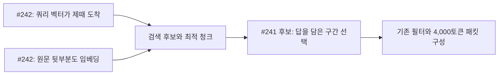

# AGE-24: PR #241·#242 결합 리뷰와 적용 계획

2026-10-02. 문서만 작성하도록 소유자가 요청한 리뷰입니다. 구현·설정·DB·원본 평가 자료를 변경하지 않았고,
추가 벤치, 재추출, 모델을 통한 임베딩 생성, 답변 모델 호출을 실행하지 않았습니다. 아래 적용·검증 단계는 **제안이며 미실행**입니다.
Phase 23이 현재 단계이고, 이 문서는 Phase 27 승인이나 AGE-24 완료를 뜻하지 않습니다.

## 결론과 검토 기준

**보완 가능합니다. #242는 근거를 찾을 기회를 늘리고, #241은 찾은 원문에서 답을 담은 부분을 고릅니다.**
그러나 개선 점수는 합산할 수 없고, 두 PR의 현재 형태를 병합해도 #241의 발췌 로직이 운영에서 켜지지는 않습니다.
추천 순서는 기존 결함 수정 → 같은 임베딩 세대에서 요청 경로 검증 → 새 정책으로 발췌 검증 → 청크 확대의
추가 효과와 상호작용 검증입니다. 원본과 파생 자료를 보존한 별도 사본에서 진행해야 합니다.

| 대상 | 고정 커밋 | 이번 리뷰의 역할 |
|---|---|---|
| 공통 base | `cf52cecad524c1d9c630e2a280760179b1290b3a` | 두 diff의 비교 기준. 과거 M0 평가의 실행 커밋으로 간주하지 않음 |
| [#241][pr241] | `32171784151be4bb6d7afe6be724a31d6f886470` | 평가 도구와 발췌 후보. 운영 코드 변경 없음 |
| [#242][pr242] | `806698a5daeead32a9c92e3ab8048364134f4aea` | 쿼리 임베딩 병렬화·사전 요청·청크 상한 변경 |
| [#243][pr243] | `3e957b4581f0f2479bda10802a71d05e31d9c83a` | 관련 `packet-v11` 설계 초안만 참고. 별도 PR 전체 리뷰나 단계 승인 아님 |

#242는 첫 리뷰의 `322ca39` 이후 갱신됐습니다. 최신 [STATUS의 high risk 분류][risk242],
[총지연과 임베딩 대기시간의 구분][wait242], [세대별 청크 상한·잘못된 상한 테스트][caps242]가 보강된 사실을 확인했습니다.
이 부분을 미수정으로 반복 지적하지 않습니다. 아래 캐시 결함 두 개는 최신 커밋에서도 남아 있습니다.

## 함께 동작할 때의 경계

- **단순 병합:** #241은 별도 CLI에서만 `audit.gather`, `retrieval.fuse`, `retrieval.grown_excerpt`를 교체합니다.
  [설치 경로][runner241]와 [전역 함수 교체][hook241]를 읽었습니다. 운영 sidecar에 이 설치 경로는 없습니다.
  따라서 병합만 하면 운영 효과는 #242이고, 20/23의 발췌 효과가 자동으로 배포되지는 않습니다.
- **실제 기능 결합:** 발췌 규칙을 운영 정책에 명시적으로 옮기는 별도 구현이 필요합니다. 기존 `packet-v10`을
  같은 이름으로 바꾸거나 CLI의 전역 monkeypatch를 서버에 설치하면 안 됩니다. [ADR 0053][policy-base]와
  #243 초안은 새 정책으로 분리하는 방향입니다. #243은 원형의 질문 중심 tie-break와 일부 구간 규칙을 제외하므로
  그 구현이 19/23 또는 20/23을 재현한다고 미리 주장할 수도 없습니다.
- **기계적 병합:** `git merge-tree --write-tree --messages --name-only 3217178 806698a`는 exit 0;
  결과 tree는 `c8f06d5a743bee53a5bdf0a857f714991335ecfc`, 공통 변경 파일은 `docs/STATUS.md`뿐이며 자동 병합됐습니다.
  두 구현을 작업 트리에 병합하거나 결합 구현을 커밋하지 않았습니다. 이것은 텍스트 충돌이 없다는 증거이지 결합 동작 검증이 아닙니다.

## 결합 시 중요한 위험

### C1 — 기존 평가기로 #242 효과를 검증했다고 오인할 수 있음 (P1, 검증 설계)

**확인:** #241은 [이전 projection을 상수로 고정][projection241]하고, [후보를 기준 실행 목록으로 치환][freeze241]합니다.
또 [5,000 ms·known_at 지정 replay][replay241]를 사용합니다. #242는 [known_at이 있으면 사전 요청 캐시를 사용하지 않으며][prefetch-route242],
청크 확대는 [새 projection 키][projection242]를 만듭니다. 기존 기준의 소스 해시와 달라지면 #241의 [비교는 거부][sourceguard241]됩니다.

**실패 조건:** 이 도구를 그대로 돌려 운영 사전 요청 효과나 24청크 효과가 입증됐다고 해석하거나,
이를 통과시키려고 기존 `source.json`·protocol·후보 자료를 덮어쓰는 경우입니다. 후보를 고정하면 upstream 개선은
의도적으로 제거되며, 사전 요청 경로는 아예 실행되지 않습니다. 기존 20/23은 발췌 실험의 근거로만 유지해야 합니다.

**조치/누락 검증:** 과거 기록은 불변으로 보존하고, 새 세대 비교는 별도 protocol과 원문·세대·쿼리 벡터 식별자로 분리합니다.
후보 고정 실험과 전체 검색 경로 실험을 다른 실행 유형으로 기록하고, 실제 fallback과 재생된 상태를 별도로 판정해야 합니다.
확신: 높음(정적 경로 확인). 결합 정확도·운영 효과: 미측정.

### C2 — 검색 범위가 넓어져도 정답 구간을 잃을 수 있음 (P2, 회귀 위험)

**확인:** #242의 [vector_candidates][best242]는 메시지마다 가장 유사한 청크 하나를 고릅니다. #241의
[focus_candidates][focus241]는 충분히 강한 벡터 청크가 있으면 단어 경로도 찾은 메시지의 발췌 범위를 그 구간으로 좁힙니다.
후보 revision이 같아도 청크가 달라지면 발췌가 바뀝니다. 또한 [인과 구간의 주제어 제거][topic241]는 전체 후보에서
단어가 등장하는 비율에 의존하므로, 새 후보가 추가되는 것만으로 기존 후보의 선택에도 영향을 줄 수 있습니다.

**실패 조건:** 확대된 뒷부분에서 더 유사한 청크가 나왔지만 실제 답은 앞부분에 있거나, 앞·뒤 청크를 함께 봐야 하는 질문입니다.
합성 후보의 ID·원문을 유지하고 최적 청크만 바꾼 함수 확인에서 `copper key` 정답 구간이 선택 결과에서 사라졌습니다.
청크·유사도는 합성 입력이며 **실제 모델이 이 순서를 만든다는 측정은 아닙니다**.

**조치/누락 검증:** 정답 앞부분+높은 유사도 뒷부분, 청크 경계의 원인/결과, 여러 사실을 묻는 질문,
새 후보 추가에 따른 인과 주제어 변화가 필요합니다. revision ID뿐 아니라 원문 해시·정규화 버전·청크/발췌 좌표를 비교합니다.
확신: 함수의 입력 의존성은 높음; 실제 정답률 하락의 빈도·규모는 미확인.

### C3 — 벡터가 살아나면서 적용되는 비밀 검사가 달라짐 (P1, 결합 안전성 미검증)

**확인:** #242에서 [keyword-only 추가 보호][secret242]는 [`_keyword_only`][keyword242]인 후보에만 적용됩니다.
같은 keyword 후보에 임계값 이상의 벡터 유사도를 주자 함수 판정이 `True → False`로 바뀌었습니다.
#241은 이 점수 필드를 유지하면서 선택하는 텍스트를 바꿉니다. 따라서 벡터 성공 증가와 발췌 확장이 동시에 일어나면
이전의 keyword-only 보호 결과를 그대로 승계할 수 없습니다.

**실패 조건:** 이전에는 keyword-only로 비밀 구간이 차단됐던 원문에 새 벡터 경로가 붙고, 새 발췌가 그 구간을 포함하는 경우입니다.
메모리 모드의 다른 필터도 있으므로 **실제 비밀 유출이 확인됐다는 뜻은 아닙니다**. 기본·strict·narrator 모드의 최종 패킷으로
확인해야 합니다. 구조화된 사실의 지식 표기와 raw excerpt의 보호도 동일하다고 가정하면 안 됩니다.

**조치/누락 검증:** 동일 원문을 vectors OFF/fallback/ON, keyword-only/혼합 경로로 전환하면서 최종 패킷의 금지 근거를 확인합니다.
전체본뿐 아니라 `short`·토큰 압력으로 잘린 형태도 확인합니다. 기존 보호 범위를 바꾸는 결정은 이 문서에서 승인하지 않습니다.
확신: 경로 분류 변화는 높음; 최종 패킷 유출은 미검증.

### C4 — 4,000토큰을 지켜도 답과 설명이 밀려날 수 있음 (P2, 품질 위험)

**확인:** 새 벡터 후보는 [fusion·top_k][fusion242]에 참여합니다. 발췌는 [패킷 fitter][fit-base]가 전체본 → 한 문장 → 잘린 형태로
줄이거나 제외할 수 있습니다. #241의 [완전한 답변 구간 반환][whole241]은 fitter를 통과하기 전의 상태입니다.

**실패 조건:** 추가 후보가 기존 정답 후보의 순서를 밀거나, 긴 목록·인과 구간이 예산을 차지해 다른 답이 빠지는 경우입니다.
기존 20/23에서 특정 구간이 온전히 들어간 사실은 새 후보 집합에서도 그 구간이 온전히 들어간다는 보장이 아닙니다.

**조치/누락 검증:** 후보 존재나 총 토큰 수 대신 최종 패킷의 근거 포함, 축약/제외 이유, 문항별 기존 통과 손실을 판정합니다.
모든 문항의 합계만 좋아지고 특정 범주의 성적이 떨어지는 것도 분리합니다. 확신: fitter 동작은 높음; 결합 회귀는 미측정.

### C5 — 백필 비용과 요청 지연이 서로 영향을 줌 (P2, 운영 위험)

**확인:** 24청크 세대는 [worker의 순차 임베딩 호출][calls242]을 늘리고, #242는 query 임베딩을 별도 스레드에서 실행합니다.
#241의 구간 선택·패킷 구성은 그 뒤의 요청 경로 작업입니다. [#242 성능 자료][perf242]는 짧은 메시지와 합성 임베더이므로
긴 메시지 재임베딩과 실제 query가 같은 임베더를 공유하는 상황을 입증하지 않습니다. 캐시 개수 제한도 실행 중 스레드 수의 제한은 아닙니다.

**실패 조건:** 백필·동시 요청·차가운 모델이 겹쳐 query 응답이 늦어지고, 발췌 작업까지 합친 전체 요청이 호스트 deadline을 넘는 경우입니다.
이때 예산을 지킨 패킷도 주입되지 않을 수 있습니다. 이번 리뷰에서 부하·지연 측정을 실행하지 않았습니다.

**조치/누락 검증:** 임베딩 대기시간뿐 아니라 sync+retrieve 전체 p95, fallback, 실제 주입/포기, 작업 수·진행률을 분리합니다.
확신: 자원 경합 가능성은 코드상 근거가 있으나, 실제 빈도와 영향은 미측정.

### C6 — 이전 정책·세대 보존과 롤백을 한 가지 문제로 보면 안 됨 (P2, 재현성 위험)

**확인:** 새 발췌 정책을 명명하는 것과 이전 벡터가 남아 있는 것은 별개입니다. [ADR 0015][retention-base]는 새 세대가 대체한
이전 벡터를 정리하며, 정리된 세대로 돌아가면 재임베딩이 필요합니다. [audit.replay][audit-base]는 필요한 세대가 제공되지 않으면
lexical-only로 재생되었다고 표시합니다. #241의 실험 전역 hook을 서버에 이식하면 정책 분리·동시 요청 격리를 보장하지 못합니다.

**실패 조건:** 24청크 백필과 정리가 끝난 뒤 설정만 8로 바꾸면 즉시 원상복구된다고 기대하거나,
운영의 `packet-v10`을 실험 monkeypatch로 바꾼 뒤 과거 trace가 동일하게 재생된다고 기대하는 경우입니다.

**조치/누락 검증:** 정책 롤백과 세대 롤백 절차를 분리하고, 비교용 사본·아티팩트를 먼저 보존합니다. 원문 삭제나 벡터 정리 정책 변경은
이 리뷰의 제안에 포함하지 않습니다. 세대 전환 중·완료 후·이전 벡터 정리 후 상태를 각각 확인해야 합니다. 확신: 높음(계약·코드).

## 기존 PR별 선행 수정과 채택 판단

| 변경 | 판단 | 근거·실패 조건·필요한 확인 |
|---|---|---|
| #242 query 임베딩 병렬화 | 조건부 채택 | DB 연결은 요청 스레드에 남음. query thread는 embedding만 실행하므로 #241의 ContextVar를 읽지 않음. 전체 지연·실패 경로 검증은 별도 |
| #242 사전 요청 캐시 | 수정 전 보류 | [id 기반 키][cache242]: 객체 해제 후 실제 ID 재사용 시 이전 모델 벡터 반환을 최신 커밋의 합성 객체에서 재현. 모델/설정 변경 격리 테스트 필요 |
| #242 실패한 사전 요청 | 수정 전 보류 | [캐시 take][take242] 후 실패한 Future를 그대로 사용. 서비스 회복 후에도 fallback, 새 호출은 성공하는 합성 확인. 실패 캐시 폐기와 제한 시간 내 정상 경로 테스트 필요 |
| #242 상한 설정화·세대별 값 사용 | 조건부 채택 | 세대별 상한 테스트가 최신 커밋에 추가됨. 같은 endpoint/model/normalizer에서 cap=8은 base와 같은 키, cap=24는 다른 키임을 순수 계산으로 확인. 요청 경로와 재임베딩을 나눠 적용 가능 |
| #242 기본값 24 | 단계적 적용 | 새 세대의 coverage·작업 비용·전환 중 검색 공백·C2/C3/C5/C6 확인 전 일괄 전환 보류 |
| #241 기록 보존·후보 고정 도구 | 검증기 수정 후 채택 | [실제 실패 상태 덮어쓰기][routes241], [CWD 의존 해시][source241]와 빈 목록 허용을 수정. 후보 고정 실험을 전체 경로 검증으로 표시하지 않을 것 |
| #241 일반 발췌 규칙 | 새 정책·검증 후 채택 후보 | vector focus·질문 중심 anchor·조건부 문장 확장의 기여를 구분. 운영 포트와 원형의 차이를 기록 |
| #241 목록·용기·인과 구간 특례 | 운영 적용 보류 | [목록 묶기][list241]는 인접한 다른 문서까지 합칠 수 있음. 다른 문서·복수 원인·변경된 상태·관련 없는 용기와 독립 대화에서 선택을 거부해야 할 사례 필요 |

#241의 20/23은 유지되는 기존 기록입니다. 저장된 최종 두 실행에서 실제 벡터 검색 40/40 ON, 패킷·토큰·후보 순서 일치,
기존 통과 손실 없음, 금지문구 1건 유지가 확인됐습니다. 이는 **알려진 개발 세트의 패킷 근거 점수**이며 답변 모델 성공률이 아닙니다.
원본 평가 커밋·원본 패킷 부재도 그대로 한계입니다. 이번 결합 리뷰에서 점수를 새로 측정하지 않았습니다.

## 실행하지 않은 최소 적용·검증 순서

1. **선행 결함부터 수정:** #242 캐시의 객체/세대 격리와 실패 복구, #241 실제 상태 검증과 비어 있지 않은 소스 식별.
   단위 확인 뒤 관련 통합 테스트에서 실제 요청 경로를 검증합니다. 이번 문서 PR에는 수정이나 새 테스트 파일이 없습니다.
2. **요청 경로만 분리:** 같은 endpoint/model/normalizer와 cap=8을 유지해 백필 변경을 분리하고,
   병렬화 단독 → 수정된 사전 요청 순서로 검증합니다. 배포 설정은 여기서 변경하지 않습니다.
3. **발췌를 명명된 정책으로 분리:** 승인된 범위에서 운영 포트를 만들고 기존 정책·trace를 보존합니다.
   원형과 다르게 가져온 규칙에는 기존 점수를 붙이지 않습니다. #243은 아직 승인 대기 초안입니다.
4. **청크 × 발췌 교차 비교:** 아래 네 조합을 별도 사본/아티팩트에 기록합니다. 질문·gold·scorer·사실·summary·prompt window·예산·
   keyword routing·first_cue/history_marks/name_variants·모델/endpoint·쿼리 벡터는 고정하고, 행/열의 지정 요인만 바꿉니다.
   원문·세대·정책·옵션·코드 SHA·진행률·출력 위치를 manifest에 남기며, 원래 23문항을 다른 분모의 평가와 섞지 않습니다.

| corpus projection | 기존 발췌 | 채택 후보 발췌 |
|---|---|---|
| 8청크 | 비교 기준 A | 발췌 효과 B |
| 24청크 | 검색 범위 효과 C | 결합 효과 D |

   같은 행 안에서는 동일 후보를 고정해 발췌 효과를 분리할 수 있지만, 행 사이에는 이전 후보를 강제로 재사용하지 않습니다.
   마지막에는 새 후보 생성부터 최종 패킷까지 전체 경로도 확인합니다. 합계뿐 아니라 A→B, A→C, B/C→D의 문항별 손실과
   새 금지 근거를 따로 기록합니다. 기존 사례와 독립 사례를 구분하고 실제 답변 점수는 패킷 점수와 별도로 보고합니다.
   원래 23문항 비교의 기준은 유지합니다: 분모·gold·scorer 불변, 기존 통과 손실 0, 새 금지문구 0.
   개선 주장은 같은 조건의 기준보다 점수가 높을 때만 붙이며, 이 비교가 AGE-24 전체 완료 조건을 대체하지 않습니다.

5. **운영 조건 확인은 마지막:** 수정된 코드의 live 경로에서 캐시 miss/hit/실패/설정 변경, 벡터 OFF/fallback/ON,
   비밀·strict·narrator, in-context/비활성 원문, 백필 동시 실행, deadline·fail-open, 중단/재시작·롤백을 검증합니다.
   새 호출·재임베딩·벤치는 보류 중이며 이 문서는 그 실행 승인이 아닙니다. 실패하면 기록을 보존하고 해당 변경만 보류합니다.

## 증거 범위와 인계

- **문서 검증:** 프로젝트의 기존 가상환경 Python으로 `apps/sidecar`에서 `PYTHONPATH=src python -B -m pytest tests/test_docs_consistency.py -p no:cacheprovider`,
  exit 0, **2 passed**. 고정 Git 객체로 근거 링크의 파일·줄 위치를 대조했습니다. 결합 코드의 테스트 결과가 아닙니다.
- **직접 확인:** 고정 커밋 diff/호출 경로, Git의 병합 가능성, 합성 후보의 구간 변경, keyword-only 분류 전환,
  최신 캐시의 ID 재사용·실패 복구 결함, cap=8/24의 세대 키 차이. 합성 객체 확인은 네트워크·DB 접근 없이 메모리에서만 수행했습니다.
- **기존 기록:** #241의 저장된 패킷 비교와 평가 결과; #242 문서의 합성 지연 측정. 이전 테스트 수를 이번 실행 결과로 옮기지 않았습니다.
- **미검증:** 결합 runtime, 실데이터에서 새 최적 청크 선택, 실제 비밀 유출, 결합 정확도·실제 모델 답변·운영 부하/중단/롤백.
- **위험도:** 실제 기능 결합은 **high risk** — memory selection, isolation, projection provenance, fail-open, 세대 전환과 복구.
  이 PR 자체는 문서만 바꿉니다.
- **다음 조치:** 먼저 두 PR의 선행 결함을 독립 수정하고, 위 순서의 검증을 구체화합니다. 두 PR을 한 번에 운영 적용하거나
  기존 20/23과 #242의 가용성 수치를 합쳐 AGE-24 완료로 판정하지 않습니다.

[pr241]: https://github.com/Sallos725/NMOS/pull/241
[pr242]: https://github.com/Sallos725/NMOS/pull/242
[pr243]: https://github.com/Sallos725/NMOS/pull/243
[risk242]: https://github.com/Sallos725/NMOS/blob/806698a5daeead32a9c92e3ab8048364134f4aea/docs/STATUS.md#L104
[wait242]: https://github.com/Sallos725/NMOS/blob/806698a5daeead32a9c92e3ab8048364134f4aea/docs/adr/0061-query-embedding-beside-the-reads.md#L30
[caps242]: https://github.com/Sallos725/NMOS/blob/806698a5daeead32a9c92e3ab8048364134f4aea/apps/sidecar/tests/test_long_messages.py#L91
[runner241]: https://github.com/Sallos725/NMOS/blob/32171784151be4bb6d7afe6be724a31d6f886470/tools/eval_recall_candidate.py#L152
[hook241]: https://github.com/Sallos725/NMOS/blob/32171784151be4bb6d7afe6be724a31d6f886470/tools/recall_candidate.py#L90
[projection241]: https://github.com/Sallos725/NMOS/blob/32171784151be4bb6d7afe6be724a31d6f886470/tools/eval_recall_candidate.py#L27
[freeze241]: https://github.com/Sallos725/NMOS/blob/32171784151be4bb6d7afe6be724a31d6f886470/tools/eval_recall_candidate.py#L147
[replay241]: https://github.com/Sallos725/NMOS/blob/32171784151be4bb6d7afe6be724a31d6f886470/tools/eval_recall_candidate.py#L161
[source241]: https://github.com/Sallos725/NMOS/blob/32171784151be4bb6d7afe6be724a31d6f886470/tools/eval_recall_candidate.py#L106
[sourceguard241]: https://github.com/Sallos725/NMOS/blob/32171784151be4bb6d7afe6be724a31d6f886470/tools/eval_recall_candidate.py#L119
[prefetch-route242]: https://github.com/Sallos725/NMOS/blob/806698a5daeead32a9c92e3ab8048364134f4aea/apps/sidecar/src/nmos_sidecar/retrieval.py#L486
[projection242]: https://github.com/Sallos725/NMOS/blob/806698a5daeead32a9c92e3ab8048364134f4aea/apps/sidecar/src/nmos_sidecar/vectors.py#L35
[best242]: https://github.com/Sallos725/NMOS/blob/806698a5daeead32a9c92e3ab8048364134f4aea/apps/sidecar/src/nmos_sidecar/vectors.py#L104
[focus241]: https://github.com/Sallos725/NMOS/blob/32171784151be4bb6d7afe6be724a31d6f886470/tools/recall_candidate.py#L28
[topic241]: https://github.com/Sallos725/NMOS/blob/32171784151be4bb6d7afe6be724a31d6f886470/tools/recall_candidate.py#L21
[secret242]: https://github.com/Sallos725/NMOS/blob/806698a5daeead32a9c92e3ab8048364134f4aea/apps/sidecar/src/nmos_sidecar/retrieval.py#L621
[keyword242]: https://github.com/Sallos725/NMOS/blob/806698a5daeead32a9c92e3ab8048364134f4aea/apps/sidecar/src/nmos_sidecar/retrieval.py#L667
[fusion242]: https://github.com/Sallos725/NMOS/blob/806698a5daeead32a9c92e3ab8048364134f4aea/apps/sidecar/src/nmos_sidecar/retrieval.py#L595
[whole241]: https://github.com/Sallos725/NMOS/blob/32171784151be4bb6d7afe6be724a31d6f886470/tools/recall_candidate.py#L82
[calls242]: https://github.com/Sallos725/NMOS/blob/806698a5daeead32a9c92e3ab8048364134f4aea/apps/sidecar/src/nmos_sidecar/vectors.py#L82
[perf242]: https://github.com/Sallos725/NMOS/blob/806698a5daeead32a9c92e3ab8048364134f4aea/docs/perf/query-embedding.md#L82
[cache242]: https://github.com/Sallos725/NMOS/blob/806698a5daeead32a9c92e3ab8048364134f4aea/apps/sidecar/src/nmos_sidecar/retrieval.py#L123
[take242]: https://github.com/Sallos725/NMOS/blob/806698a5daeead32a9c92e3ab8048364134f4aea/apps/sidecar/src/nmos_sidecar/retrieval.py#L133
[routes241]: https://github.com/Sallos725/NMOS/blob/32171784151be4bb6d7afe6be724a31d6f886470/tools/eval_recall_candidate.py#L141
[list241]: https://github.com/Sallos725/NMOS/blob/32171784151be4bb6d7afe6be724a31d6f886470/tools/recall_answer_spans.py#L36
[policy-base]: https://github.com/Sallos725/NMOS/blob/cf52cecad524c1d9c630e2a280760179b1290b3a/docs/adr/0053-excerpts-fill-their-length.md#L15
[fit-base]: https://github.com/Sallos725/NMOS/blob/cf52cecad524c1d9c630e2a280760179b1290b3a/apps/sidecar/src/nmos_sidecar/packet.py#L316
[retention-base]: https://github.com/Sallos725/NMOS/blob/cf52cecad524c1d9c630e2a280760179b1290b3a/docs/adr/0015-superseded-projection-retention.md#L36
[audit-base]: https://github.com/Sallos725/NMOS/blob/cf52cecad524c1d9c630e2a280760179b1290b3a/apps/sidecar/src/nmos_sidecar/audit.py#L163
