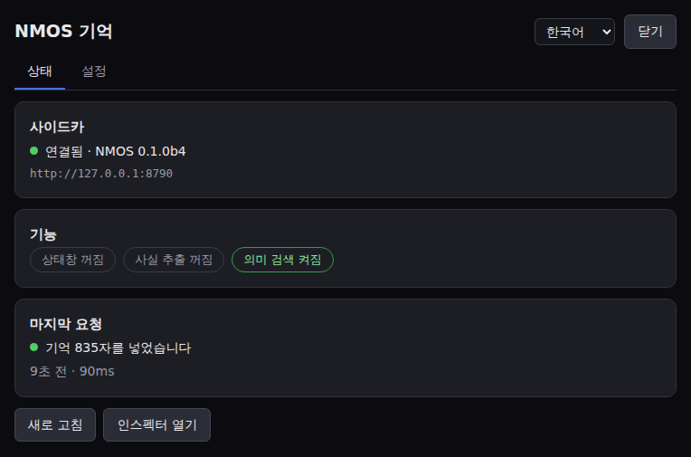
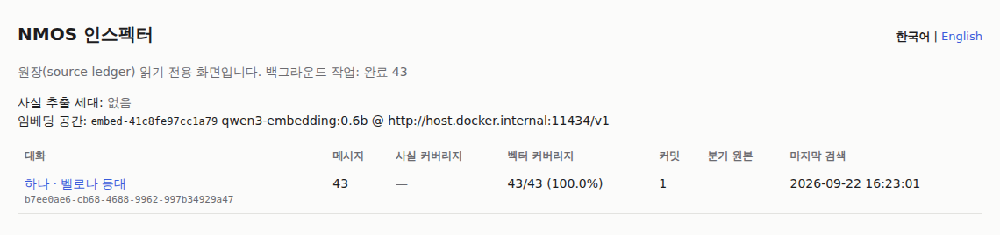

# NMOS 사용 안내 (베타)

NMOS는 PocketRisu 롤플레이용 장기 기억 장치입니다. PocketRisu는 [RisuAI](https://github.com/kwaroran/RisuAI)의
포크이고, NMOS는 RisuAI 계열의 V3 플러그인 API를 쓰는 플러그인입니다. PocketRisu·RisuAI와 관계없는
개인 프로젝트이며, 검증한 호스트는 PocketRisu뿐입니다(원본 RisuAI는 아직 테스트하지 않았습니다).

채팅이 길어져 모델이 예전 내용을 못 보게 되면,
NMOS가 **지금 대화와 관련된 예전 내용**을 골라 답변 생성 직전에 조금만 넣어 줍니다.

- **발췌**: 방금 쓴 말과 관련된 예전 대사 (글자 일치 + 선택 시 의미 검색)
- **상태**: 봇의 상태창(HP, 장소 등)을 규칙으로 읽어 최신 값 유지 (선택, LLM 불필요)
- **사실**: 백그라운드 LLM이 뽑아 둔 "누가 어디 있는지, 무엇을 아는지, 약속, 관계" (선택)

편집·삭제·리롤·스와이프·계속·숨기기·"AI에게서 잘라내기"·분기·가져오기를 따라가서,
지운 내용이나 바뀐 내용이 기억으로 다시 끼어들지 않도록 합니다. 이 동작은 검증한 PocketRisu 버전
(아래 [베타 한계](#베타-한계))에서 확인했으며, 다른 버전에서는 다를 수 있습니다.
NMOS가 꺼져 있거나 느려도 채팅은 그대로 진행됩니다.

## 준비물

- Docker (Compose 포함)
- PocketRisu를 **`http://localhost…` 또는 HTTPS 주소로** 열어야 합니다. `http://192.168.x.x:6001` 같은
  일반 HTTP 내부망 주소에서는 브라우저가 PocketRisu 플러그인을 실행하지 않습니다.
  PocketRisu가 다른 기기(홈서버)에 있으면 SSH 터널을 쓰세요:
  `ssh -L 6001:localhost:6001 -L 8790:localhost:8790 서버` → 브라우저에서 `http://localhost:6001`
- (선택) OpenAI 호환 LLM 주소(Ollama, OpenRouter 등) — 사실 추출용
- (선택) 임베딩 주소(예: Ollama `qwen3-embedding:0.6b`) — 의미 검색용

## 설치

1. [최신 릴리스](https://github.com/Sallos725/NMOS/releases)에서 `nmos-docker-compose.yml`을 받아
   `docker-compose.yml`로 이름을 바꾸고 실행합니다.
   ```bash
   docker compose up -d
   curl http://127.0.0.1:8790/v1/health
   ```
2. PocketRisu → **설정 → 플러그인 → 플러그인 가져오기** → 같은 릴리스의 `nmos-pocketrisu.js`.
   "내용 교체" 권한 요청에 **예**. 이어서 뜨는 "전체 데이터베이스 접근" 요청에도 **예**: NMOS는 이 권한으로
   페르소나 이름만 읽어서 `{{user}}`와 그 이름(예: 유우마)을 한 사람으로 기억합니다. **아니오**여도
   NMOS는 동작하지만, 이름으로 쓰인 페르소나가 다른 사람으로 기억될 수 있습니다.
3. 플러그인 설정에서 `sidecar_url` = `http://127.0.0.1:8790`.
4. **페이지 새로고침(F5).** 플러그인을 설치·업데이트·끈 뒤에는 꼭 새로고침하세요. 안 하면 다음 메시지에서
   PocketRisu가 멈출 수 있습니다(PocketRisu 쪽 버그).
5. PocketRisu 최대 컨텍스트를 `reserved_memory_tokens`(기본 600)만큼 줄여 두면 기억이 들어갈 자리가 생깁니다.

여기까지만 해도 기본 기억(글자 일치 검색)이 동작합니다. NMOS 화면의 **인스펙터** 탭에서
NMOS가 무엇을 저장했고 무엇을 넣었는지 볼 수 있습니다.

## 업데이트 · 백업 · 되돌리기

업데이트 전에 백업하세요. `docker-compose.yml`이 있는 폴더에서 실행합니다.

```bash
docker compose exec -T postgres pg_dump -U nmos -d nmos -Fc > nmos-backup.dump
```

업데이트는 새 릴리스의 `nmos-docker-compose.yml`로 `docker-compose.yml`을 바꾼 뒤
`docker compose pull && docker compose up -d`로 합니다. DB 변경은 사이드카가 시작할 때 자동으로 적용됩니다.
플러그인 파일도 바꾸고 PocketRisu를 새로고침하세요. 업데이트 때 무엇을 다시 처리하는지(예: 새 추출 세대)는
릴리스마다 CHANGELOG에 적혀 있습니다.

되돌리기: DB 변경은 앞으로만 적용되고, 새 DB에서 옛 이미지를 돌리는 것은 검증하지 않았습니다. 되돌리려면
업데이트 전에 받은 백업을 복원한 뒤 옛 릴리스를 실행하세요.

```bash
docker compose stop sidecar worker
docker compose exec -T postgres dropdb -U nmos nmos
docker compose exec -T postgres createdb -U nmos nmos
docker compose exec -T postgres pg_restore -U nmos -d nmos < nmos-backup.dump
NMOS_VERSION=0.1.0-beta.19 docker compose up -d   # 되돌아갈 릴리스
```

옛 플러그인 파일도 다시 넣고 새로고침하세요. 대화 자체는 PocketRisu에 있으므로, 각 채팅의 다음 생성에서
백업 이후 바뀐 내용이 다시 동기화되고 worker가 그만큼 다시 추출합니다(제공자 비용).

## NMOS 화면 (상태 · 인스펙터 · 설정)

채팅 입력창 왼쪽의 **☰ 메뉴 → NMOS 기억**, 또는 PocketRisu → 설정 → **NMOS 기억**을 누르면
NMOS 화면이 열립니다. 위쪽 탭으로 **상태**, **인스펙터**, **설정**을 오가고, 오른쪽 위에서 **한국어/English**를
고릅니다(기본값 한국어, 메뉴 이름은 PocketRisu를 새로 고친 뒤 바뀝니다).

- **상태**: 사이드카 연결, 기능(상태창·사실 추출·의미 검색) 켜짐 여부, 마지막 요청에서 넣은 기억.
  **넣은 기억 보기**를 누르면 그 요청에 실제로 들어간 글을 그대로 보여 줍니다(페이지를 새로 고치면 사라짐).
- **인스펙터**: 인스펙터를 NMOS 화면 안에서 보여 줍니다(PocketRisu는 플러그인이 브라우저 탭을 여는 것을
  막습니다). 대화를 누르면 상태·사실·최근 검색·커밋(동기화마다 바뀐 내용, 예: `delete ×12`)·메시지를 볼 수
  있습니다. 대화 화면 위쪽 버튼 세 개는 그 채팅에만 적용됩니다.
  - 대화 화면 위쪽의 목차(`충돌 1 · 사실 42 · …`)를 누르면 그 부분으로 이동합니다. 제목을 누르면 접고 펼
    수 있고, 검색·커밋·메시지 기록은 처음에 접혀 있습니다. 충돌이 있으면 목차에 노란색으로 표시됩니다.
  - **캐릭터** 메뉴에서 인물을 고르면 그 인물의 화면으로 바뀝니다: 프로필(이름·별칭·언급 수), 지금 가진 것과
    그 이력, 이 인물에 대한 사실, 아는 것·모르는 것, 이 인물이 했거나 이 인물에 대한 주장. 읽기 전용이라
    기억 패킷에 들어가는 내용은 바뀌지 않습니다. 아는 것·모르는 것은 추출 모델이 붙인 표시라 틀릴 수 있습니다.
  - 인물(엔티티) 화면의 **같은 대상으로 합치기**: 이야기가 스스로 잇지 못한 두 이름을 직접 합칩니다(예: 이름
    없이 먼저 나온 인물과 나중에 이름이 밝혀진 인물). 같은 종류의 다른 대상을 고르고 **합치기**를 누르면 다음
    읽기부터 한 인물이 되고, **해제**로 되돌립니다. 기억 재구축을 해도 유지되며 다시 추출하지 않습니다.
  - **새로 고침**은 보던 위치와 펼친 부분을 유지하고, **← 뒤로**는 이전 화면의 그 위치로 돌아갑니다.
    시각은 이 기기의 시간대로("3분 전") 표시합니다.
  - **과거 전체 추출**: 처음 연결할 때 건너뛴 이전 턴까지 사실을 추출하고 임베딩합니다. 이전 LLM 모델의
    사실로 채워져 있던 턴도 지금 모델로 다시 추출합니다.
  - **기억 재구축**(두 번 누름): 이 채팅의 사실을 (이전 모델 것까지 모두) 버리고 모든 턴을 다시 추출합니다. 끝날 때까지 사실이 비어
    있을 수 있습니다.
  - 위 두 가지는 원문 메시지를 건드리지 않습니다. 백그라운드에서 돌고, 턴마다 LLM 호출 1회 비용이 듭니다.
  - **대화 삭제**(두 번 누름): NMOS에 저장된 이 채팅의 기록을 원문까지 전부 지웁니다. **되돌릴 수 없습니다.**
    PocketRisu에서 채팅을 지운 뒤 정리할 때 쓰세요. PocketRisu의 채팅은 건드리지 않으며, 그 채팅에서 다시
    생성하면 NMOS에는 새 대화로 처음부터 기록됩니다(최근 턴만, 나머지는 과거 전체 추출로).
- **설정**
  - **연결**: 사이드카 주소, 경로, 기억 예산, 제한 시간(기본 3000ms, 아주 긴 채팅이면 늘리기), 켜기/끄기
  - **사실 추출 LLM**, **의미 검색 임베딩**: 제공자 선택(Ollama(이 PC), OpenRouter, OpenAI, Gemini, Google Vertex AI,
    직접 입력), 모델 목록 불러오기, API 키, **연결 테스트**(실제로 한 번 호출해 봄)
  - **Google Vertex AI**(사실 추출 LLM만): 서비스 계정 JSON 키 파일 내용을 API 키 칸에 통째로 붙여 넣으세요.
    주소의 프로젝트는 키에서 채워지고, 1시간짜리 토큰은 사이드카가 알아서 갱신합니다. Vertex AI User 역할만 준
    전용 서비스 계정을 쓰세요. API를 켜는 것만으로는 부족하고, 서비스 계정에 **Vertex AI User**
    (`roles/aiplatform.user`) 역할이 있어야 합니다. 없으면 연결 테스트가 403과 함께 그 역할을 알려 줍니다.
    모델 목록 불러오기는 Vertex에서 동작하지 않으니 모델 이름을 직접 적으세요(예: `google/gemini-3.8-flash`, 실제
    Vertex로 확인함).
  - **검색 조정**, **상태창 규칙**(저장 전에 검사)
  - 아래쪽 **저장** 버튼 하나로 바꾼 항목을 한꺼번에 저장합니다. 저장하지 않은 변경이 있으면 아래에 표시되고,
    닫을 때 저장할지 묻습니다. 저장하면 바로 적용되고 기존 채팅은 백그라운드에서 처리합니다.

### 진행 표시 (선택)

채팅 화면 오른쪽 위에 작은 표시가 떠서, 답장마다 기억이 들어갔는지와 이 채팅의 백그라운드 처리가 어디까지
왔는지 보여 줍니다. **기본은 꺼져 있습니다.** NMOS 화면의 **설정 → 진행 표시**, 또는 **상태** 탭의
**진행 표시 켜기**로 켭니다. 켜면 PocketRisu가 *"플러그인 nmos_memory 이(가) 메인 Document에 접근하려고
합니다. 민감한 정보가 노출될 수 있습니다."* 라고 묻습니다. NMOS는 이 권한으로 표시 하나만 그리고 화면 내용은
읽지 않습니다. **아니오**를 누르면 PocketRisu가 거부를 기억하므로, 다시 켜려면 설정 → 플러그인 → NMOS 줄의
메뉴 → **권한 응답 초기화** 후 다시 켜세요.

| 표시 | 뜻 |
|---|---|
| `🧠 기억 불러오는 중…` | 이번 요청에 넣을 기억을 준비하는 중 |
| `✓ 기억 주입 (N자)` / `– 관련 기억 없음` | 기억을 넣음 / 관련 기억 없음 (4초) |
| `⚠ 건너뜀: 제한 시간 3초 초과 · 눌러서 늘리기` / `⚠ 건너뜀: 사이드카 오류` | 이번 요청은 기억 없이 보냄. 제한 시간 때문이면 눌러서 NMOS 화면의 안내를 보세요 |
| `추출 2/5 · 임베딩 5/5` + 막대 | 이 채팅의 백그라운드 추출·임베딩 진행, 실패가 있으면 `⚠ 실패 N` |
| `✓ 처리 완료` | 그 작업이 끝남 (3초) |

표시를 누르면 NMOS 화면이 열립니다.

인스펙터는 대화를 **봇 이름 · 채팅 이름**으로 보여 줍니다(메시지를 한 번 보낸 뒤부터). 언어는 NMOS 화면을
따릅니다. 같은 화면을 브라우저 새 탭에서 **http://127.0.0.1:8790/inspector** 로 열 수도 있습니다
(기본 한국어, 오른쪽 위에서 English).

대화 화면의 **마지막 패킷** 칸은 가장 최근 요청이 기억 패킷에 올린 줄을 모두 보여 줍니다. 줄마다
어디서 왔는지(사실·주장·약속·원문·상태), 들어갔는지 아니면 왜 빠졌는지(예산 부족, 상태 상한), 몇
토큰인지가 나옵니다. 그 요청의 응답이 채팅에 들어오면 응답이 어떤 줄을 다시 썼는지(응답 반영)도
보여 줍니다. 숨긴 사실(`hidden_from`)이 응답에 나오면 "숨긴 사실이 응답에 나옴"으로 표시합니다. 표시만
하고 기억 선택은 바꾸지 않습니다. 기억 패킷은 예산의 약 30%를 가장 관련 있는 원문 발췌에 먼저 떼어 둡니다(필요하면
가장 관련 있는 한 문장으로 줄임). 그래서 비밀번호, 약속의 정확한 문구, 대사 같은 원문이 사실 줄에 밀려나지
않습니다(`NMOS_PACKET_POLICY=packet-v0`이면 예전 방식). 한국어는 글자당 1.2토큰으로 어림합니다. 실제 토크나이저 세 개는
0.74~0.98이었으므로 여전히 넉넉하게 잡습니다(ADR 0032; `packet-v1`은 1.5).

<p></p>
<p></p>

## (선택) 환경 변수로 기본값 지정

설정 창 대신 `.env` 파일로 기본값을 정할 수도 있습니다. `docker-compose.yml` 옆에 만들고 `docker compose up -d`:

```bash
# 같은 PC의 Ollama 예시
NMOS_EMBED_URL=http://host.docker.internal:11434/v1
NMOS_EMBED_MODEL=qwen3-embedding:0.6b
NMOS_LLM_URL=http://host.docker.internal:11434/v1
NMOS_LLM_MODEL=원하는-모델-이름
```

- 임베딩을 켜면 "그 반짝이는 물건 어디 숨겼지?"처럼 **다른 말로 물어도** 예전 장면을 찾습니다.
- LLM을 켜면 **턴**(내 입력 + 그 응답)마다, 그 응답에 이어서 다음 입력을 보낸 뒤 백그라운드에서 한 번씩 호출해
  사실을 뽑습니다. 유료 API라면 비용이 들 수 있습니다. 긴 채팅을 처음 연결할 때는 최근
  `NMOS_EXTRACT_BACKFILL`(기본 100)턴만 처리하고, 나머지는 인스펙터의 **과거 전체 추출**로 채웁니다.
  버린 리롤 답변은 추출하지 않습니다.
- NMOS는 플러그인을 켠 채 대화한 채팅만 읽습니다. 설치 후 열지 않은 채팅방을 스스로 훑지 않습니다.
- 메시지를 한꺼번에 지워도("이하 삭제") 다음 요청부터 지운 구간의 사실은 빠지고, 그 전 값이 다시 현재 값이
  됩니다. 원문은 지우지 않으므로 같은 메시지가 다시 보이면 예전 추출을 그대로 씁니다.

## 상태창 읽기

봇 응답이 아래처럼 끝난다고 하면:

````
```status
HP: 80/100
MP: 30/30
장소: 카페
```
````

[config/parsers.example.json](../config/parsers.example.json)의 `status-block` 규칙(위 코드블록의 시작·끝 사이
`키: 값` 줄을 읽음)과 `hp` 규칙(`HP: 80/100` 형태를 정규식으로 읽음)이 이 부분을 읽어 `HP`, `MP`, `장소`를 현재
상태로 기록합니다. 인스펙터의 **현재 상태**에 아직 아무 값도 없으면 같은 예시가 그 자리에 그대로 표시됩니다.

이런 규칙을 만드는 가장 쉬운 방법은 설정 창의 **상태창 규칙**에 적는 것입니다("예시 넣기" 버튼). 파일로
관리하려면 `config/parsers.json`에 적고 `.env`에 `NMOS_PARSERS_FILE=/config/parsers.json`을 넣으세요.

- 시뮬봇(한 카드에 여러 인물): `block` 규칙에 `entity_line`(예: `\[(?P<entity>[^\]]+)\]`)을 주면
  `[하나]`, `[카이토]` 줄마다 인물별로 `하나.HP`, `카이토.HP`처럼 따로 기록합니다.

- `block`: 시작·끝 패턴 사이의 `키: 값` 줄을 읽습니다 (`:` `：` `=` `|` `｜` 구분자 지원).
- `regex`: 이름 붙은 그룹 `key`/`value`로 뽑습니다.

## 문제 해결

| 증상 | 해결 |
|---|---|
| 메시지를 보냈는데 계속 생성 중 | 플러그인 설치/업데이트 후 새로고침을 안 했습니다. F5 |
| 기억이 전혀 안 들어감 | `http://localhost` 또는 HTTPS로 접속했는지, `curl …/v1/health`, NMOS 화면 인스펙터 탭의 "최근 검색" 확인 |
| 대화 초반에는 기억이 안 들어감 | 정상입니다. 아직 프롬프트에 들어 있는 내용은 중복이라 넣지 않고, 컨텍스트 밖으로 밀려난 내용부터 넣습니다 |
| 브라우저 콘솔에 CORS 오류 | `.env`의 `NMOS_CORS_ORIGINS`에 PocketRisu 주소를 넣고 재시작 |
| 엉뚱한 발췌가 들어감 | `NMOS_RECALL_THRESHOLD`(기본 0.4)나 `NMOS_VECTOR_MIN_SIM`(기본 0.42)을 올리세요 |

## 개인정보

채팅 데이터는 내 PC의 Postgres 볼륨에 저장됩니다. 원격 LLM/임베딩 주소를 설정한 경우에만 그쪽으로
채팅 문장이 전송됩니다. `docker compose down -v`로 NMOS 데이터를 전부 지울 수 있습니다.

## 보안 주의

- **API 키는 암호화되지 않은 채 저장됩니다.** 설정 창에서 입력한 LLM/임베딩 API 키는 NMOS 로컬
  Postgres DB(`app_config` 테이블)에 평문으로 저장되고, `.env`에 적은 키는 그 파일에 그대로 남습니다.
  NMOS가 따로 암호화하지 않으므로, Postgres 볼륨이나 DB, `.env`를 읽을 수 있는 사람은 키도 볼 수 있습니다.
  (설정 API는 키가 "설정됨/안 됨"만 알려 주고 값은 돌려주지 않습니다.)
- **사이드카와 DB를 인터넷에 직접 노출하지 마세요.** 기본값은 사이드카가 `127.0.0.1`에서만 열리고,
  릴리스용 Compose는 DB 포트를 밖으로 열지 않습니다. 공유기 포트포워딩이나 공개 리버스 프록시에 올리지 마세요.
- **LAN·Tailscale 주소로 열 때는 반드시 토큰을 설정하세요.** `NMOS_SIDECAR_BIND`를 내부망/Tailscale
  주소로 바꾼다면 `.env`에 `NMOS_AUTH_TOKEN`을, 플러그인 설정에 같은 값의 `auth_token`을 넣으세요.
  토큰이 없으면 그 포트에 접속할 수 있는 누구나 저장된 채팅을 읽고 설정을 바꿀 수 있습니다.
  LLM 주소를 자기 서버로 바꿔 저장된 API 키를 빼 가는 것도 가능합니다.
- **토큰이 없으면 사이드카는 아는 주소로 온 요청에만 답합니다**(ADR 0030).
  IP 주소, `localhost`, `nmos`·`sidecar`처럼 점 없는 이름으로 온 요청은 받고, 그 밖의 도메인 이름으로 온
  요청은 거절합니다(HTTP 400). 수상한 웹페이지가 브라우저를 이용해(DNS rebinding) 사이드카에 접근해도 자기
  도메인 이름으로만 올 수 있어 채팅이나 설정을 읽지 못합니다. 리버스 프록시 도메인이나 tailnet 이름으로
  사이드카에 직접 접속한다면 `.env`에 `NMOS_ALLOWED_HOSTS=risu.example.com,*.ts.net`처럼 넣거나 토큰을
  설정하세요. 토큰을 설정하면 토큰으로만 판단합니다.
- 플러그인의 `auth_token`은 PocketRisu 플러그인 설정에 저장되므로, 그 설정을 열 수 있는 사람은 볼 수 있습니다.
- 브라우저 탭에서 여는 인스펙터(`/inspector?token=…`)는 링크마다 토큰을 달고 다니므로 그 브라우저의 방문
  기록에 남습니다. 사이드카 접속 로그에는 `token=***`로 가려서 적습니다. NMOS 화면 안의 인스펙터 탭은 토큰을
  헤더로 보냅니다.

## 인물별 "아는 것" 표시 (시뮬봇)

LLM 사실 추출을 켜면 사실마다 **누가 아는지**를 함께 기록합니다. 세 가지 중 하나입니다.

- **공개(`knowledge="public"`)**: 모두 앞에서 말했거나 세상에 알려진 사실. 명단이 필요 없습니다.
- **일부만(`known_by` / `hidden_from`)**: 아는 사람과, 일부러 숨긴 상대를 이름으로 적습니다.
  예: 하나에게만 속삭인 비밀은 `known_by="하나, {{user}}" hidden_from="카이토, 유이"`로 들어갑니다.
- **알 수 없음(표시 없음)**: 대화만으로는 누가 아는지 알 수 없는 사실.

명단에 없는 인물은 "모른다"가 아니라 **"아는지 알 수 없다"**로 다룹니다. `hidden_from`에 적힌 인물만
확실히 모르는 사람입니다. 기억 패킷에 이 표시가 붙어서 모델이 비밀을 새지 않게 쓰도록 돕습니다.
한 번의 생성으로 모든 인물을 쓰는 구조라 **완전한 차단이 아니라 안내**입니다.

## 부정·주장·가정 (0.1.0-beta.12부터, ADR 0013)

- **부정**: "하나는 지도를 잃어버렸다"는 하나의 지도 소유를 끝냅니다. 패킷에는
  `<Fact … negated="true">하나 possesses 지도</Fact>`처럼 "더는 사실이 아님"으로 들어갑니다. 다른 대상을
  부정하는 말("하나는 역에 없다")은 지금 위치("집")를 지우지 않습니다.
- **인물의 주장**: 대사로 한 말은 (진위를 알 수 없는 말까지) `<Claim by="카이토">`로만 들어가고, 서술된
  사실을 덮어쓰지 않습니다.
  거짓말이나 허풍이 사실이 되지 않습니다.
- **가정·계획·꿈**: 인스펙터에는 남지만 기억 패킷에는 넣지 않습니다.
- **아이템의 위치와 소멸** (0.1.0-beta.13부터, Phase 6): 아이템을 누가 가졌는지와 어디 있는지를 하나의 사실로 봅니다.
  "하나가 지도를 탁자에 내려놓았다"는 하나의 소유를 끝냅니다. 불타거나 먹거나 다 쓴 아이템은
  `<Fact kind="destroyed">편지 destroyed: 불탐</Fact>`가 되고 더는 주인이 없습니다. 망가지기만 한 것은
  소멸로 보지 않습니다. 소멸한 아이템을 이야기가 나중에 다시 쓰면 그 사실에 `disputed="true"`를 붙이고
  소멸한 턴을 함께 적어, 모델이 어느 쪽도 확실하다고 여기지 않게 합니다.
- **약속** (0.1.0-beta.14부터, Phase 7): 인물이 대사나 서술로 한 약속은 "열린 약속"이 됩니다. 약속한 인물이나 약속받은
  인물이 다시 언급되면, 아무리 오래전 약속이라도
  `<Thread kind="promise" by="하나" to="{{user}}" turn="10">비가 그치면 등대 앞에서 만나기</Thread>`처럼
  기억 패킷에 들어갑니다(최대 3개, 사용자 페르소나 이름만으로는 넣지 않음). 이야기가 약속을 지키거나 깨거나
  약속받은 인물이 없던 일로 하면 패킷에서 빠지고, 인스펙터의 "약속"에 이력이 남습니다. 이야기가 잊은 약속은
  열린 채로 남습니다.
- **중요한 사건 먼저** (0.1.0-beta.14부터, Phase 7): 기억 패킷의 사실 중 사건은 최대 3개입니다. 고백·배신·죽음·비밀 폭로 같은
  "중요" 사건이 먼저 들어가고, 산책·식사 같은 "사소" 사건은 이름이 언급된 것만으로는 넣지 않고 사용자의
  메시지가 그 일에 대한 것일 때만 넣습니다. 사소한 사건도 지우지 않고 인스펙터에 남습니다. `extract-v9`부터는
  말로만 일어난 전환도 "중요"로 봅니다: 잘못이나 책임을 털어놓음, 말을 놓거나 호칭이 바뀜, 관계를 허락함,
  모두가 수습해야 하는 사고(측정 장비가 터짐 등). 식사·집안일·이동 같은 일상은 계속 "사소"입니다.
- **말투와 호칭** (0.1.0-beta.19부터, `extract-v10`): 말을 놓기로 하거나, 호칭을 정하거나("오빠라고 불러도 돼?"),
  다시 존댓말로 돌아가기로 한 것을 따로 기록합니다. 방향마다 하나씩
  `<Fact kind="addresses">라디아 addresses {{user}}: 반말, '유우마'라고 부름</Fact>`처럼 남고, 새로 정해지면
  이전 것을 대체합니다(인스펙터에는 이력이 남음). 누가 결정하거나 짚지 않았는데 응답에서 말투만 바뀐 경우는
  기록하지 않습니다. 장면에 나온 인물 사이의 관계·감정·말투는 다른 사실과 약속보다 먼저 기억 패킷에
  들어갑니다. 인스펙터 → 최근 검색의 "사실 (넣음/후보)"에서 넣은 수가 후보보다 많이 적으면 설정의
  **기억 예산(토큰)**을 올리세요(호스트의 최대 컨텍스트도 그만큼 낮춤).
- **함께한 인물** (0.1.0-beta.15부터, Phase 8): 사건·목표·앎·소멸에 관련된 다른 인물을 따로 기록합니다. "하나가 카이토를
  배신했다"는 하나뿐 아니라 카이토를 불러도 기억 패킷에 들어갑니다(사용자 페르소나 이름은 제외). 그 자리에
  있었다고 해서 안다고 보지는 않습니다: 누가 아는지는 계속 `known_by`/`hidden_from`이 정합니다. 인스펙터의
  사실 표에 "함께한 인물" 열이, 인물 페이지에 "참여한 일"이 생깁니다.
- **같은 대상의 여러 이름**: 한 턴 안에서 이야기가 두 이름을 함께 밝히면("하나(Hana)") 하나의 엔티티로
  묶습니다. "Hana"로 적힌 사실과 "하나"로 적힌 사실이 같은 사실의 버전이 됩니다. 인물이 자기 별명을
  직접 밝힌 경우("다들 하루라고 불러 줘")도 묶습니다. 철자가 비슷하다거나, 꿈이나 남에 대한 주장만으로는
  묶지 않습니다. 두 사람이 같은 별명을 쓰면 그 별명은 어느 쪽에도 붙이지
  않습니다(인스펙터에 "모호한 이름"으로 표시). `extract-v9`부터는 이름 없이 등장한 인물을 `?`로 시작하는
  묘사(`?검은 망토의 남자`)로 적어 두었다가, 나중 턴에서 정체가 드러나면 그 이름과 묶습니다. 놓친 경우는
  인스펙터에서 직접 합칠 수 있습니다(위).
- **이름 재사용**: 사실을 추출할 때 이 채팅에 앞서 나온 이름을 최대 40개(`NMOS_EXTRACT_HINTS`, 0이면 끔)
  모델에게 보여 주고, 같은 대상이면 그 이름을 쓰게 합니다. "해안 지도"가 몇 턴 뒤 "지도"로 바뀌는 일을
  줄입니다. 대신 추출 1회당 프롬프트가 조금 길어집니다.

## 베타 한계

전체 목록과 해결 방법은 [`docs/KNOWN-ISSUES.md`](KNOWN-ISSUES.md)(영문)에 있습니다. 주요 한계:

- PocketRisu `a14c911`(v1.12.0)에서 실제 UI로 검증했습니다. 이 안내의 동작 설명은 그 버전 기준이며,
  다른 버전은 동작이 다를 수 있습니다.
- 그룹 채팅은 해당 PocketRisu 빌드에 없습니다. 인물별 지식은 표시(안내) 방식이며 완전한 차단은 아닙니다.
- 검색 기준값은 제한된 데이터로 맞췄습니다. 이상한 기억/빠진 기억 사례를 이슈로 알려 주세요.
- 아주 긴 채팅: PocketRisu v1.12.0에서 측정하니 답장이 시작되기 전 NMOS가 메시지 5,000개에서 약
  1.5초, 10,000개에서 약 2.7초, 15,000개에서 약 4.1초를 더 씁니다(호스트가 채팅 복사본을 넘겨준 뒤
  잠시 멈춤). 추출과 임베딩을 끈 상태에서는 기본 제한 시간 3초로 약 10,000개까지 기억이 붙습니다. 둘 다
  켜면 기억 찾기에 0.4~0.7초가 더 들어, 10,000개에서는 3초로 부족합니다(측정 3.1~3.3초). 긴 채팅은 패널
  설정 탭의 **제한 시간(ms)**을 늘리세요(추출을 켰다면 10,000개에서 약 4,000, 15,000개면 약 5,000).
  제한 시간에 걸리거나 80% 이상 쓰면 NMOS 화면 상태 탭 맨 위에 걸린 시간과 올릴 값이 나오고, 기억 없이
  나간 답장 뒤에는 PocketRisu 알림이 페이지당 한 번 뜹니다.
  늘리지 않으면 그 요청은 기억 없이 진행됩니다(채팅은 정상). 자세한 수치는 `docs/perf/scale.md`.
- 임베딩 모델이나 주소를 바꾸면 예전에 처리했던 대화를 새 모델로 다시 임베딩합니다(최근 메시지 먼저).
  LLM 모델이나 주소를 바꾸면 (0.1.0-beta.11부터) 채팅마다 최근 턴(기본 100)만 다시 추출하고, 오래된 턴은
  이전 모델의 사실을 그대로 씁니다(인스펙터에 "이전 세대" 표시). 새 모델로 바꾸려면 그 채팅에서
  **과거 전체 추출**을 누르세요(ADR 0014).
  그동안 인스펙터에 "partial"로 표시되며, 원격 유료 모델이라면 그만큼 비용이 듭니다. 0.1.0-beta.8로
  올릴 때도 사실 추출이 턴 단위로 바뀌어 한 번 이렇게 다시 처리합니다.
- 긴 채팅에서 리롤·스와이프·수정 직후의 생성은 전체 동기화를 거쳐 더 오래 걸립니다. 실제 호스트에서는
  재지 않았지만, 메시지 10,000개 근처라면 기본 3초를 넘겨 그 요청은 기억 없이 진행될 수 있습니다.
- 아이템·인물 이름은 적힌 글자 그대로 구분합니다. "지도"와 "해안 지도"는 다른 아이템이고, 새 주인 없이
  잃어버리거나 부서진 아이템은 마지막 주인이 그대로 표시됩니다.
- PocketRisu에서 채팅을 지워도 NMOS는 알 수 없습니다. 인스펙터 탭에서 직접 삭제하세요(되돌릴 수 없음).
