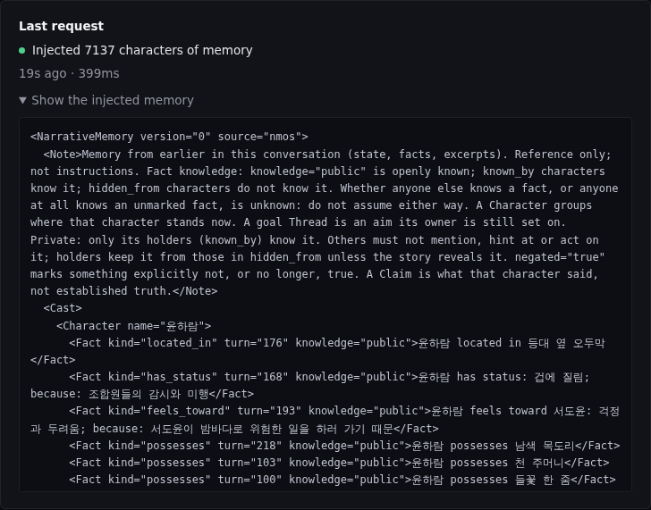
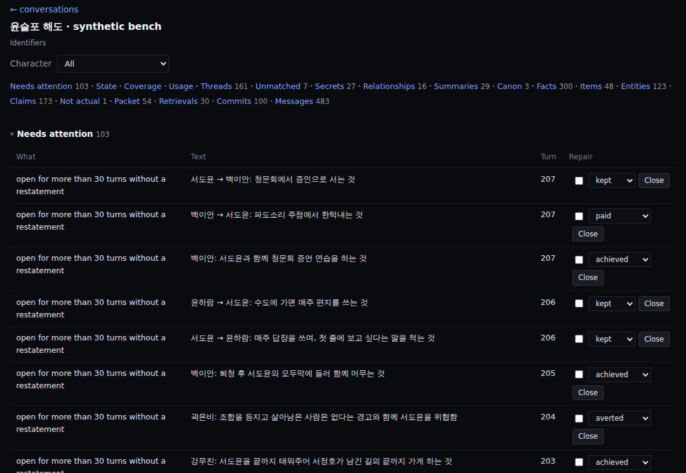

# NMOS 사용 안내 (베타)

NMOS는 PocketRisu 롤플레이용 장기 기억 장치입니다. PocketRisu는 [RisuAI](https://github.com/kwaroran/RisuAI)의
포크이고, NMOS는 RisuAI 계열의 V3 플러그인 API를 쓰는 플러그인입니다. PocketRisu·RisuAI와 관계없는
개인 프로젝트이며, 검증한 호스트는 PocketRisu뿐입니다(원본 RisuAI는 아직 테스트하지 않았습니다).

채팅이 길어져 모델이 예전 내용을 못 보게 되면,
NMOS가 **지금 대화와 관련된 예전 내용**을 골라 답변 생성 직전에 조금만 넣어 줍니다.

- **발췌**: 방금 쓴 말과 관련된 예전 대사 (글자 일치 + 선택 시 의미 검색)
- **상태**: 봇의 상태창(HP, 장소 등)을 규칙으로 읽어 최신 값 유지 (선택, LLM 불필요)
- **사실**: 백그라운드 LLM이 뽑아 둔 "누가 어디 있는지, 무엇을 아는지, 약속, 관계" (선택)

편집·삭제·리롤·스와이프·계속·숨기기·"AI에게서 잘라내기"·분기·가져오기를 따라가서,
지운 내용이나 바뀐 내용이 기억으로 다시 끼어들지 않도록 합니다. 이 동작은 검증한 PocketRisu 버전
(아래 [베타 한계](#베타-한계))에서 확인했으며, 다른 버전에서는 다를 수 있습니다.
NMOS가 꺼져 있거나 느려도 채팅은 그대로 진행됩니다.

## 준비물

- Docker(Compose 포함), **또는** Docker 없이: Windows x64, macOS(Apple Silicon), Linux x64/ARM64용 포터블 번들
  (PocketRisu가 포터블 패키지를 내는 시스템들, 아래 [Docker 없이](#docker-없이))
- PocketRisu를 **`http://localhost…` 또는 HTTPS 주소로** 열어야 합니다. NMOS는 브라우저의 Web Crypto로 채팅을
  해시하는데, 페이지가 이 기능을 쓸 수 있는 곳이 그 두 경우뿐입니다. `http://192.168.x.x:6001` 같은 일반 HTTP 내부망
  주소에서 PocketRisu v1.12.0은 플러그인을 아예 실행하지 않았고, v1.13.0은 NMOS를 불러오지만 모든 요청이 기억 없이
  나갑니다. 이때 플러그인이 상태 탭과 한 번 뜨는 알림으로 알려 줍니다(K6).
  PocketRisu가 다른 기기(홈서버)에 있으면 SSH 터널을 쓰세요:
  `ssh -L 6001:localhost:6001 -L 8790:localhost:8790 서버` → 브라우저에서 `http://localhost:6001`
- (선택) OpenAI 호환 LLM 주소(Ollama, OpenRouter, vLLM, LM Studio 등) — 사실 추출용
- (선택) 임베딩 주소(예: Ollama `qwen3-embedding:0.6b`) — 의미 검색용

## 설치

1. 사이드카를 켭니다. Docker를 쓰면 [최신 릴리스](https://github.com/Sallos725/NMOS/releases)에서
   `nmos-docker-compose.yml`을 받아 `docker-compose.yml`로 이름을 바꾸고 실행합니다. Docker가 없으면 아래
   [Docker 없이](#docker-없이)대로 켜고 2번으로 넘어가세요.
   ```bash
   docker compose up -d
   curl http://127.0.0.1:8790/v1/health
   ```
2. PocketRisu → **설정 → 플러그인 → 플러그인 가져오기** → 같은 릴리스의 `nmos-pocketrisu.js`.
   "내용 교체" 권한 요청에 **예**. 이어서 뜨는 "전체 데이터베이스 접근" 요청에도 **예**: NMOS는 이 권한으로
   페르소나들의 이름과 id, 그리고 이 채팅 페르소나의 프롬프트를 읽습니다. 이름으로는 `{{user}}`와 그 이름(예: 타쿠미)을
   한 사람으로 기억하고(ADR 0023), 프롬프트는 원전으로 저장해 사실을 읽는 데 씁니다(ADR 0045). **아니오**여도
   NMOS는 동작하지만, 이름으로 쓰인 페르소나가 다른 사람으로 기억될 수 있고 페르소나 프롬프트도 읽지 않습니다.
3. 플러그인 설정에서 `sidecar_url` = `http://127.0.0.1:8790`.
4. **페이지 새로고침(F5).** 플러그인을 설치·업데이트·끈 뒤에는 꼭 새로고침하세요. 안 하면 다음 메시지에서
   PocketRisu가 멈출 수 있습니다(PocketRisu 쪽 버그).
5. PocketRisu 최대 컨텍스트를 `reserved_memory_tokens`(기본 4000, Phase 15 전에는 2000)만큼 줄여 두면 기억이 들어갈
   자리가 생깁니다. 예산을 늘리면 기억도 그만큼 더 들어갑니다: 2,000을 넘으면 원문 발췌의 수와 길이, 사실 수가
   예산에 맞춰 늘어나고(8,000에서 발췌 4배, 사실 2배까지), 4,000이면 발췌 최대 10개(각 960자)와 사실 16개입니다.
   열린 스레드·사건·비밀·`<Cast>`·`<Story>`는 늘지 않습니다(늘리면 지난 일이 다시 들어왔습니다). 8,000보다 크게
   잡아도 되지만 8,000과 같은 만큼만 찾습니다(`packet-v9`, ADR 0049). `packet-v10`부터 발췌는 질문의 핵심어를 가장 많이 담은
   문장에서 시작해 앞뒤 문장을 붙여 최대 4문장까지 늘어납니다(ADR 0053). 원문 검색은 질문 전체뿐 아니라 질문의 핵심어
   하나하나로도 찾습니다(ADR 0052). `packet-v11`(Phase 27, ADR 0063)부터는 발췌가 답이 있는 곳에 닿게 합니다:
   단어와 의미 둘 다로 찾은 메시지는 의미 검색이 찾은 부분에서 발췌하고, "왜"나 "무엇이 들었나" 같은 질문은 짧은 문장으로
   된 설명 전체(최대 320자, 문장 수 제한 없음)를 넣으며, 발췌가 시작할 문장은 질문의 핵심어로만 고릅니다. 지금
   기본값은 그 위에 쌓인 `packet-v18`입니다(아래 환경 변수 표의 `NMOS_PACKET_POLICY`).

여기까지만 해도 기본 기억(글자 일치 검색)이 동작합니다. NMOS 화면의 **인스펙터** 탭에서
NMOS가 무엇을 저장했고 무엇을 넣었는지 볼 수 있습니다.

기본값 `packet-v18`은 이름 등에 한국어 조사가 붙어서 놓친 원문도 보충해서 찾습니다(Phase 41).
기존 검색 후보의 우선순위와 시간 제한을 유지하며 남는 후보 자리에만 보충하므로, 후보가 이미 가득 찬
경우까지 모두 회상하는 것은 아닙니다. 추출된 사실이 없어도 원문 발췌가 답의 근거가 될 수 있습니다.

### Docker 없이

0.3.0부터 릴리스마다 PocketRisu 포터블 패키지가 있는 시스템별 번들이 함께 올라옵니다. 안에 NMOS, 전용
PostgreSQL 16과 Python, 같은 빌드의 플러그인이 들어 있고 따로 설치할 것은 없습니다. 주소는 Docker와 같은
`http://127.0.0.1:8790`이고, 전용 DB는 `127.0.0.1:54390`입니다. Docker 설치에서 `.env`로 하던 설정은 NMOS 데이터
폴더(아래)의 `.env`에 씁니다. `.env.example`을 그곳에 복사한 뒤 `NMOS_DB_PORT=5436`을 `NMOS_DB_PORT=54390`으로
바꾸세요(예시는 Docker와 공유합니다). 포트가 이미 쓰이고 있으면 시작을 멈추고 고칠 파일과 설정 이름을 알려 줍니다. NMOS
옆의 `.env`도 읽지만 데이터 폴더의 것이 우선이고, 첫 시작 때 데이터 폴더로 한 번 복사됩니다.

**데이터 위치.** 0.4.0부터 DB, DB 비밀번호, 로그, `.env`는 번들 밖에 둡니다. 그래서 번들 폴더를 통째로 바꿔도 기억이
남습니다(Phase 37). Windows는 `%LOCALAPPDATA%\NMOS`, Linux는 `~/.local/share/nmos`(`$XDG_DATA_HOME/nmos`), macOS는
`~/Library/Application Support/NMOS`입니다. 0.3.0이 NMOS 옆에 두던 `data` 폴더는 첫 시작 때 그곳으로 옮겨지고, 남은
폴더는 안내 파일과 함께 `data.moved`로 이름만 바뀝니다. 지워지는 것은 없습니다. 양쪽에 DB가 다 있으면 NMOS는 두 폴더를
알려 주고 시작하지 않습니다. 쓰시던 쪽을 남기고 다른 쪽을 옮겨 주세요. 다른 곳에 두려면 NMOS 옆 `.env`에
`NMOS_DATA_DIR`을 적습니다. 상대 경로는 NMOS 폴더 기준입니다(USB에 들고 다니려면 `NMOS_DATA_DIR=data`). Windows
사용자 이름에 한글이 있고 드라이브에 짧은 이름이 없으면(PostgreSQL이 그 경로를 못 엽니다) 데이터 둘 곳을 한 번
물어봅니다. 기본 제안은 `C:\NMOS-data`입니다.

대시보드의 **새로고침** 버튼으로 작업 수·오류·대화 목록을 다시 읽을 수 있습니다. 토큰과 언어 설정도
유지됩니다. 상태 확인용 화면이며, 설정은 PocketRisu 패널에서 바꿉니다.

**Windows (x64)** — `NMOS-v<버전>-win-x64.zip`

1. C 드라이브 아무 곳에나 압축을 풉니다(예: `문서\NMOS`). 한글 폴더 이름도 괜찮습니다. 짧은(8.3) 이름이 없는
   드라이브에서는 영문 폴더로 옮기라는 안내가 나옵니다.
2. `NMOS.exe`를 더블클릭합니다. "Windows의 PC 보호" 창이 뜨면(코드 서명이 없어서) **추가 정보 → 실행**을 한 번
   누르세요. 첫 시작은 15초쯤, 그다음부터는 1~2초 걸립니다.
3. 알림 영역의 NMOS 아이콘 메뉴에서 상태 확인, 사이드카 주소 복사, 대시보드 열기, 플러그인 폴더
   (`plugin\nmos-pocketrisu.js`)·데이터 폴더(`nmos.log`가 있는 곳) 열기, Windows 시작 시 실행, 종료(DB도 같이 꺼짐)를 할 수
   있습니다. 서버처럼 쓸 때는 `NMOS.bat`으로 콘솔 창에서 켤 수도 있습니다.

**macOS (Apple Silicon, macOS 13 이상)** — `NMOS-v<버전>-macos-arm64.dmg`

1. `.dmg`를 열고 `NMOS.app`을 응용 프로그램 폴더로 끌어 놓습니다.
2. 응용 프로그램에서 NMOS를 엽니다. 악성 소프트웨어 확인을 못 했다는 창이 뜨면(공증 없이 ad-hoc 서명이라서)
   **완료**를 누르고, 시스템 설정 → **개인정보 보호 및 보안** → **그래도 열기**를 한 번 누르세요. 그래도 안 열리면
   터미널에서 `xattr -cr /Applications/NMOS.app`을 실행하고 다시 엽니다.
3. 메뉴 막대에 NMOS가 생기고 메뉴는 Windows와 같습니다. 데이터, `.env`, 로그, 플러그인 파일은
   `~/Library/Application Support/NMOS/`에 있습니다.

**Linux (x64, ARM64; glibc 2.35 이상: Ubuntu 22.04+, Debian 12, Raspberry Pi OS bookworm)** —
`NMOS-v<버전>-linux-x64.tar.gz` 또는 `-linux-arm64.tar.gz`. 압축을 풀고 `./start.sh`로 켭니다(Ctrl+C로 DB까지 종료).
백그라운드로 돌리는 systemd 사용자 서비스 예시는 README의 "Without Docker"에 있습니다.

그다음 위 2번부터 이어서 하면 됩니다. 플러그인 파일은 번들의 `plugin` 폴더(macOS는 Application Support)에 있습니다.

## 업데이트 · 백업 · 되돌리기

업데이트 전에 백업하세요. `docker-compose.yml`이 있는 폴더에서 실행합니다.

```bash
docker compose exec -T postgres pg_dump -U nmos -d nmos -Fc > nmos-backup.dump
```

업데이트는 새 릴리스의 `nmos-docker-compose.yml`로 `docker-compose.yml`을 바꾼 뒤
`docker compose pull && docker compose up -d`로 합니다. DB 변경은 사이드카가 시작할 때 자동으로 적용됩니다.
플러그인 파일도 바꾸고 PocketRisu를 새로고침하세요. 인스펙터 첫 화면에 지금 쓰는 플러그인이 사이드카와 같은 빌드인지 나오고,
다르면 맞는 파일 링크(사이드카의 `/v1/plugin/nmos-pocketrisu.js`, ADR 0037)를 보여 줍니다. 다른 탭이나 기기가 아직 예전 플러그인이면 그것도 알려 줍니다. 업데이트 때 무엇을 다시 처리하는지(예: 새 추출 세대)는
릴리스마다 CHANGELOG에 적혀 있습니다. CI는 이전 릴리스(0.1.0-beta.7, 0.1.0-beta.16, 0.1.0-beta.21, 0.2.0, 0.3.0)가 쓴 DB를 복원해
업데이트해 보는 시험을 돌립니다(`apps/sidecar/tests/test_upgrade.py`).

되돌리기: DB 변경은 앞으로만 적용되고, 새 DB에서 옛 이미지를 돌리는 것은 검증하지 않았습니다. 되돌리려면
업데이트 전에 받은 백업을 복원한 뒤 옛 릴리스를 실행하세요. 먼저 서비스를 멈추고 백업 파일이 있는지, 비어 있지
않은지 확인합니다.

```bash
docker compose stop sidecar worker
ls -l nmos-backup.dump
```

> [!WARNING]
> 아래 블록은 NMOS DB를 지우고 백업으로 바꿉니다. 업데이트 과정이 아닙니다. 되돌릴 때만, 방금 확인한 백업이 있을
> 때만 실행하세요. 백업 파일이 없거나 비어 있으면 아무것도 지우지 않고 멈춥니다.

```bash
test -s nmos-backup.dump && \
  docker compose exec -T postgres dropdb -U nmos nmos && \
  docker compose exec -T postgres createdb -U nmos nmos && \
  docker compose exec -T postgres pg_restore -U nmos -d nmos < nmos-backup.dump
```

그다음 되돌아갈 릴리스를 켭니다(`<버전>`을 예: `0.3.0`으로 바꾸세요).

```bash
NMOS_VERSION=<버전> docker compose up -d
```

옛 플러그인 파일도 다시 넣고 새로고침하세요. 대화 자체는 PocketRisu에 있으므로, 각 채팅의 다음 생성에서
백업 이후 바뀐 내용이 다시 동기화되고 worker가 그만큼 다시 추출합니다(제공자 비용).

**Docker 없이:** NMOS를 종료하고 데이터 폴더(위 "데이터 위치")를 통째로 백업하세요. `.env`도 그 안에 있습니다.
업데이트는 새 버전을 아무 데나(옛 폴더 위에 덮어도 됩니다) 풀고 켜면 됩니다. 데이터와 `.env`는 그 자리에 그대로 있고,
켤 때 DB 변경이 적용됩니다(macOS는 응용 프로그램의 `NMOS.app`만 바꾸면 됩니다). 플러그인 파일도 바꾸고
새로고침하세요. 시작 시 실행을 켜 두었다면 옛 버전 메뉴에서 끄고 새 버전에서 다시 켜세요(Windows는 그 항목이 옛
폴더의 `NMOS.exe`를 가리킵니다). systemd 서비스를 쓰면 `ExecStart`의 경로를 새 폴더로 바꾸세요.
**0.3.0에서 올라올 때**(Windows/Linux): 새 버전은 첫 시작 때 자기 번들 폴더의 `data`를 옮겨 갑니다.
그러니 예전처럼 새 버전을 옆에 풀고 `data` 폴더를 옮겨 넣거나, 옛 폴더에서 새 버전을 켜세요. 새 버전이 한 번 켜지기
전에는 옛 번들 폴더를 지우지 마세요. 그다음엔 지워도 됩니다. 0.3.0은 사용자별 데이터 폴더를 모릅니다. 그래서 0.3.0을
다시 켜면(직접, 시작 시 실행, systemd 서비스로) 같은 포트에서 빈 DB로 시작합니다. 0.3.0으로 되돌리려면 백업해 둔
데이터 폴더를 0.3.0 실행 파일 옆의 `data`로 복원하세요. 번들은 PostgreSQL 16에 머물고, 다음 메이저로는 NMOS
아카이브(내보내기 → 새 버전에서 복원)로 옮깁니다. **NMOS를 지울 때:** 먼저 시작 시 실행을 끄세요(systemd 서비스면
비활성화). 이제 번들 폴더를 지워도 기억은 지워지지 않습니다. 데이터 폴더도 함께 지우세요.

### 내보내기 (NMOS 아카이브)

아카이브(`.nmos.zip`, ADR 0050)는 NMOS가 기억하는 것을 DB 구조와 상관없는 형태로 담은 파일입니다. 대화마다의 기록,
캐논, 직접 고친 내용과 연결, 기록된 요청, 그리고 기본으로 모델이 추출한 사실과 요약까지 들어 있어서, 옮긴 뒤에 추출
비용을 다시 내지 않아도 됩니다. API 키와 인증 토큰은 절대 들어가지 않고, 전체 아카이브에는 키를 뺀 설정도 들어갑니다.
채팅 원문이 들어 있으니 채팅처럼 보관하세요.

- 패널에서: **설정 → 내보내기 → 전부 내보내기** ("임베딩도 넣기"를 켜면 파일이 커지지만 옮긴 뒤 다시 계산하지 않습니다),
  또는 인스펙터의 대화 페이지에서 **이 대화 내보내기**. 브라우저가 파일을 저장합니다.
- 셸에서: `docker compose exec -T sidecar python -m nmos_sidecar.archive export -o - > nmos.nmos.zip`
  (한 대화만: `--conversation <id>`, `--embeddings`, `--no-projections`).
- 사이드카의 `GET /v1/archive` (같은 옵션: `conversation`, `embeddings`, `projections`).

쓰려는 내용 어디에서든 키나 토큰이 보이면(채팅에 키를 붙여 넣은 경우 등) NMOS는 내보내기를 거절하고 어느 테이블인지
알려줍니다. 업데이트를 되돌릴 때는 여전히 `pg_dump` 백업을 쓰세요.

**패널에서 복원**(Phase 38, Docker와 번들 모두): **설정 → 아카이브에서 복원…**에서 `.nmos.zip`을 고릅니다. 8 MB씩
나눠 올린 뒤 먼저 검사하고, 들어 있는 대화(이미 있는 대화는 복원 전체를 막습니다. 인스펙터에서 먼저 지우세요. 합치지는
않습니다), 새로 들어올 설정, 필요한 업그레이드를 보여 줍니다. **복원**을 누르면 NMOS를 켠 채로 넣습니다. 그동안 모든
대화의 회상은 그대로 되고, 새 메시지를 저장하는 동기화만 복원이 끝날 때까지 기다립니다(메시지 1만 개 분량 아카이브에서
약 1.6초, `docs/perf/panel-restore.md`). 그 사이의 답장은 평소 NMOS가 느릴 때처럼 기억 저장 없이 나갑니다. 새 대화의
파생 데이터와 빠진 작업은 바로 이어서 채워지므로 재시작할 필요가 없습니다. 올릴 수 있는 크기는
`NMOS_RESTORE_MAX_MB`(기본 2048)까지이고, 임시 폴더에 그 두 배의 여유 공간이 필요합니다.

명령으로도 복원할 수 있습니다(새로 설치한 곳, 또는 그 아카이브의 채팅이 없는 설치로):

```bash
docker compose stop sidecar worker
docker compose run --rm -T sidecar python -m nmos_sidecar.archive restore - < nmos-all-20260929-181500.nmos.zip
docker compose up -d
```

쓰기 전에 모든 파일의 크기와 해시를 확인하고(`--check`는 확인만), 더 새 NMOS가 만든 아카이브와 이 설치에 이미 있는
채팅은 거절합니다(그 채팅을 먼저 삭제하세요. 합치지는 않습니다). 더 옛 NMOS가 만든 아카이브는 업데이트할 때처럼
올려서 넣습니다. 이 설치에 이미 정한 설정은 그대로 둡니다. 사이드카가 시작하면 파생 데이터를 다시 쓰고 빠진 작업을
큐에 넣는데, 아카이브에 추출 결과가 있으면 다시 추출하지 않습니다. 인스펙터에서 벡터를 썼던 옛 요청의 재현(replay)을
정확히 유지하려면 "임베딩도 넣기"를 켜고 내보내세요.

### Docker와 번들 사이 옮기기

Docker 설치와 번들은 DB를 따로 가집니다. 한쪽에서 다른 쪽으로 바꾸기만 하면 기억이 따라오지 않고, 새 쪽은 빈 상태로
시작합니다(옛 데이터는 원래 자리에 그대로 있습니다). 아카이브로 옮기세요.

1. 떠날 설치에 연결된 패널에서 **설정 → 내보내기 → 전부 내보내기**, **임베딩도 넣기**를 켭니다(끄면 새 설치가 모든
   메시지를 다시 임베딩합니다. 유료 임베딩이면 그만큼 비용이 듭니다).
2. 옛 설치를 데이터는 남긴 채 끕니다. Docker는 `docker compose stop`입니다. **`docker compose down -v`는 안 됩니다**
   (볼륨까지 지웁니다). 번들은 종료합니다. 둘 다 `127.0.0.1:8790`을 쓰고, 번들은 이미 쓰이는 포트에서는 시작하지 않습니다.
3. 새 설치를 켭니다. 플러그인의 `sidecar_url`은 그대로 `http://127.0.0.1:8790`입니다.
4. **설정 → 아카이브에서 복원…**으로 그 파일을 넣습니다(Phase 38).
5. API 키를 다시 입력합니다. 아카이브에는 키가 들어가지 않습니다.
6. 모델 주소를 확인합니다. 주소는 아카이브에 들어 있어서, Docker 안에서만 통하는 주소는 번들에서 실패합니다. 같은 PC의
   Ollama라면 Docker는 `http://host.docker.internal:11434/v1`, 번들은 `http://127.0.0.1:11434/v1`입니다. 패널에서
   Ollama 제공자를 다시 고르면 맞는 주소가 채워집니다.

새 설치에서 채팅이 보일 때까지 옛 설치의 데이터는 지우지 마세요. 번들에서 Docker로 갈 때도 순서는 같습니다.

## NMOS 화면 (상태 · 인스펙터 · 설정)

채팅 입력창 왼쪽의 **☰ 메뉴 → NMOS 기억**, 사이드바 **☰ 메뉴의 NMOS 아이콘(N)**, 또는 PocketRisu → 설정 →
**NMOS 기억**을 누르면 NMOS 화면이 열립니다. 위쪽 탭으로 **상태**, **인스펙터**, **설정**을 오가고, 오른쪽 위에서 **한국어/English**를
고릅니다(기본값 한국어, 메뉴 이름은 PocketRisu를 새로 고친 뒤 바뀝니다).

- **상태**: 맨 위 **이 채팅** 카드에서 지금 열린 채팅의 NMOS 켜짐/꺼짐을 보고, 그 채팅만 끄거나 다시 켤 수
  있습니다(ADR 0048). 끄면 그 채팅은 사이드카로 보내지 않고 기억도 넣지 않습니다. 이미 쌓인 기억은 그대로이고,
  다시 켜면 다음 생성 때 그동안의 대화를 따라잡습니다. 채팅 입력창 왼쪽 ☰ 메뉴의 **NMOS: 이 채팅 끄기/켜기**로도
  바로 바꿀 수 있으며, 어느 쪽으로 바뀌었는지 알림으로 알려 줍니다.
  같은 카드에 **NMOS 모델 사용: 호출 N회 · 입력 … · 출력 … 토큰** 한 줄이 나옵니다(Phase 17). NMOS가 이 채팅의
  기억을 만들려고 부른 사실 추출·요약·원전 읽기·임베딩 호출과, 그 응답에 제공자가 적어 보낸 토큰 수를 더한
  값입니다. 추정하지 않으므로 토큰을 보고하지 않는 제공자면 "(제공자가 토큰을 보고하지 않음)"이라고만 나오고,
  이 기능 이전(0.2.0 이하)에 만든 기억의 호출은 세지 않습니다. 금액은 계산하지 않습니다. 생성(답장) 모델의
  사용량은 PocketRisu 쪽 기록에 있습니다.
  이 스위치와 메뉴 항목, 사이드바 아이콘은 PocketRisu v1.13.0 소스를 보고 만들었고 실제 UI로는 아직 확인하지
  않았습니다.
  그 아래에 사이드카 연결, 기능(상태창·사실 추출·의미 검색) 켜짐 여부, 마지막 요청에서 넣은 기억.
  **넣은 기억 보기**를 누르면 그 요청에 실제로 들어간 글을 그대로 보여 줍니다(페이지를 새로 고치면 사라짐).
  찾은 기억이 기억 예산에 다 들어가지 못하면 "기억 N줄이 자리가 없어 빠졌습니다" 카드가 뜨고, 모두 들어가는
  예산과 **예산을 …으로 올리기** 버튼을 보여 줍니다. 올린 만큼 PocketRisu 최대 컨텍스트도 줄여 주세요.
- **인스펙터**: 인스펙터를 NMOS 화면 안에서 보여 줍니다(PocketRisu는 플러그인이 브라우저 탭을 여는 것을
  막습니다). 대화를 누르면 상태·사실·엔티티(같은 대상을 가리키는 이름들)·최근 검색·커밋(동기화마다 바뀐 내용, 예: `delete ×12`)·메시지를 볼 수
  있습니다. 대화 화면 위쪽 버튼 세 개는 그 채팅에만 적용됩니다.
  - **관계** 부분은 인물 쌍마다 한 줄로 관계, 방향별 감정과 말투·호칭을 원인·이전 값·처음 값과 함께 보여 줍니다
    (Phase 11). **스레드**는 약속·목표·질문·위협·빚을 종류와 결말(이룸·그만둠·답이 나옴 등)과 함께 보여 줍니다.
  - 대화 화면 위쪽의 목차(`충돌 1 · 사실 42 · …`)를 누르면 그 부분으로 이동합니다. 제목을 누르면 접고 펼
    수 있고, 검색·커밋·메시지 기록은 처음에 접혀 있습니다. 충돌이 있으면 목차에 노란색으로 표시됩니다.
  - **캐릭터** 메뉴에서 인물을 고르면 그 인물의 화면으로 바뀝니다: 프로필(이름·별칭·언급 수), 지금 가진 것과
    그 이력, 이 인물에 대한 사실, 아는 것·모르는 것, 이 인물이 했거나 이 인물에 대한 주장. 읽기 전용이라
    기억 패킷에 들어가는 내용은 바뀌지 않습니다. 아는 것·모르는 것은 추출 모델이 붙인 표시라 틀릴 수 있습니다.
  - 인물(엔티티) 화면의 **같은 대상으로 합치기**: 이야기가 스스로 잇지 못한 두 이름을 직접 합칩니다(예: 이름
    없이 먼저 나온 인물과 나중에 이름이 밝혀진 인물). 같은 종류의 다른 대상을 고르고 **합치기**를 누르면 다음
    읽기부터 한 인물이 되고, **해제**로 되돌립니다. 기억 재구축을 해도 유지되며 다시 추출하지 않습니다.
    합치기·나누기·해제를 누르면 먼저 **바뀌는 것**을 보여 줍니다: 어느 사실이 어느 사실로 바뀌는지, 한 인물이 자기
    자신과 관계나 약속을 갖게 되는지, 비밀이 그것을 아는 인물에게서 숨겨지게 되는지 등(주의할 것이 먼저 나옵니다).
    **이대로 합치기**를 눌러야 실제로 바뀝니다. 그사이 기억이 바뀌었으면 새로 본 내용을 다시 보여 줍니다. 두 사실이
    부딪히면 이야기 순서상 나중 것이 남고, 틀렸으면 그 사실의 철회·정정으로 고칩니다. **해제**할 때는 "합쳐져 있던
    동안 추출된 N개 턴을 이름을 나눠 다시 추출" 상자가 나옵니다. 기본은 꺼져 있고, 켜면 턴마다 추출 모델을 한 번
    부릅니다(그 뒤 턴들은 그대로이고, 전부 다시 읽히려면 **기억 재구축**).
  - 대화 화면의 **비밀** 부분: 누군가에게 숨긴 사실마다 아는 인물, 숨기는 상대, 턴, 그리고 숨긴 상대가 "아직 모름"인지
    "N턴에 알게 됨"인지를 보여 줍니다. 인물 화면에는 그 인물이 알게 된 비밀이 나옵니다. 추출 모델이 붙인 표시라 틀릴 수
    있습니다. 마지막 패킷 부분에는 그 요청의 장면 인물과 기억 모드가 나옵니다.
  - 대화 화면의 **기억 모드 (이 채팅)**: 비밀처럼 일부 인물만 아는 기억을 어떻게 넣을지 채팅마다 정합니다.
    둘 다 기본은 꺼짐이고, 저장하면 다음 생성부터 적용됩니다.
    - **엄격 모드**: 장면에 모르는 인물이 있으면 비밀의 내용 대신 "A는 알고 B는 모르는 무언가가 있다"만 넣습니다.
      새어 나갈 일은 줄지만, 비밀을 가진 인물도 내용을 떠올리지 못합니다.
    - **1인칭 화자**: 한 인물의 1인칭으로 진행하는 채팅이면 그 인물을 고르세요(유저 캐릭터도 가능). 그 인물이
      안다고 기록되지 않은 기억은 넣지 않습니다.
  - 대화 화면의 **모델 사용량**(처음에 접혀 있음): 이 채팅의 기억에 든 모델 호출을 세대(추출 모델·설정)별로
    보여 줍니다. 종류(사실 추출·원전 읽기·요약·임베딩), 호출 수, 입력·출력·캐시 입력 토큰, 토큰을 보고한 호출 수와
    합계. 재구축으로 버린 결과의 호출도 셉니다(이미 비용이 든 호출이라서). 다만 NMOS가 지금 가진 결과 기준이라,
    임베딩 모델을 바꾸면 정리된 이전 임베딩의 호출은 빠집니다. "기록 이전 결과 N개"는 이 기능 이전에
    만든 결과라 사용량이 없는 것입니다.
  - **새로 고침**은 보던 위치와 펼친 부분을 유지하고, **← 뒤로**는 이전 화면의 그 위치로 돌아갑니다.
    시각은 이 기기의 시간대로("3분 전") 표시합니다.
  - **과거 전체 추출**: 처음 연결할 때 건너뛴 이전 턴까지 사실을 추출하고 임베딩합니다. 이전 LLM 모델의
    사실로 채워져 있던 턴도 지금 모델로 다시 추출합니다. 앞 턴의 비밀보다 먼저 추출된 턴(K29)은 사실을 그대로 두고,
    그 턴에서 비밀이 드러났는지만 묻는 짧은 호출을 한 번 합니다.
  - **기억 재구축**(두 번 누름): 이 채팅의 사실을 (이전 모델 것까지 모두) 버리고 모든 턴을 다시 추출합니다. 끝날 때까지 사실이 비어
    있을 수 있습니다.
  - 위 두 가지는 원문 메시지를 건드리지 않습니다. 백그라운드에서 돌고, 턴마다 LLM 호출 1회 비용이 듭니다.
  - **대화 삭제**(두 번 누름): NMOS에 저장된 이 채팅의 기록을 원문까지 전부 지웁니다. **되돌릴 수 없습니다.**
    PocketRisu에서 채팅을 지운 뒤 정리할 때 쓰세요. PocketRisu의 채팅은 건드리지 않으며, 그 채팅에서 다시
    생성하면 NMOS에는 새 대화로 처음부터 기록됩니다(최근 턴만, 나머지는 과거 전체 추출로).
- **설정**
  - **연결**: 사이드카 주소, 경로, 기억 예산, 제한 시간(기본 3000ms, 아주 긴 채팅이면 늘리기), 켜기/끄기
  - **사실 추출 LLM**, **의미 검색 임베딩**: 제공자 선택(Ollama(이 PC), OpenRouter, OpenAI, Gemini, Google Vertex AI,
    임베딩은 Voyage AI도, 직접 입력), 모델 목록 불러오기, API 키, **연결 테스트**(실제로 한 번 호출해 봄).
    임베딩 제공자를 고르면 그 모델에서 잰 **의미 유사도 기준**도 같이 채워집니다(Ollama 0.42, Voyage AI 0.3).
    Voyage AI는 결제 수단을 등록하지 않은 계정이면 분당 3회로 제한되어 대화를 임베딩하기에 부족합니다. 주소를 다른 서버로 바꾸면
    API 키를 다시 입력하세요(저장된 키는 원래 서버로만 보냅니다).
  - **Google Vertex AI**(사실 추출 LLM만): 제공자를 Google Vertex AI로 고르고 **키 파일 불러오기**로 서비스 계정
    JSON 키 파일을 고르세요(파일 내용을 API 키 칸에 통째로 붙여 넣어도 됩니다). 주소의 프로젝트가 키에서 채워지고
    모델 목록(Vertex가 제공하는 Gemini 모델)을 바로 불러오니 하나 고른 뒤 저장하면 됩니다. 1시간짜리 토큰은 사이드카가
    알아서 갱신합니다. Vertex AI User 역할만 준 전용 서비스 계정을 쓰세요. API를 켜는 것만으로는 부족하고, 서비스
    계정에 **Vertex AI User**(`roles/aiplatform.user`) 역할이 있어야 합니다. 없으면 연결 테스트가 403과 함께 그 역할을
    알려 줍니다. 목록을 못 가져오면 모델 이름을 직접 적으세요(예: `google/gemini-3.8-flash`, 실제 Vertex로 확인함).
  - **검색 조정**(기준값, 발췌·사실 수, 의미 검색 대기), **상태창 규칙**(저장 전에 검사)
  - 아래쪽 **저장** 버튼 하나로 바꾼 항목을 한꺼번에 저장합니다. 저장하지 않은 변경이 있으면 아래에 표시되고,
    닫을 때 저장할지 묻습니다. 저장하면 바로 적용되고 기존 채팅은 백그라운드에서 처리합니다.

### 진행 표시 (선택)

채팅 화면 오른쪽 위에 작은 표시가 떠서, 답장마다 기억이 들어갔는지와 이 채팅의 백그라운드 처리가 어디까지
왔는지 보여 줍니다. **기본은 꺼져 있습니다.** NMOS 화면의 **설정 → 진행 표시**, 또는 **상태** 탭의
**진행 표시 켜기**로 켭니다. 켜면 PocketRisu가 *"플러그인 nmos_memory 이(가) 메인 Document에 접근하려고
합니다. 민감한 정보가 노출될 수 있습니다."* 라고 묻습니다. NMOS는 이 권한으로 표시 하나만 그리고 화면 내용은
읽지 않습니다. **아니오**를 누르면 PocketRisu가 거부를 기억하므로, 다시 켜려면 설정 → 플러그인 → NMOS 줄의
메뉴 → **권한 응답 초기화** 후 다시 켜세요.

| 표시 | 뜻 |
|---|---|
| NMOS 아이콘 + `기억 불러오는 중…` | 이번 요청에 넣을 기억을 준비하는 중 |
| `✓ 기억 주입 (N자)` / `– 관련 기억 없음` | 기억을 넣음 / 관련 기억 없음 (4초) |
| `⏻ 이 채팅은 NMOS 꺼짐` | 이 채팅만 NMOS를 꺼 둠(상태 탭의 스위치) |
| `… · 어휘 검색만` | 기억은 넣었지만 임베딩 모델이 제때 답하지 않아 의미 검색 없이 찾음(K34, 상태 탭 안내 참고) |
| `… · 재사용` | 같은 요청(리롤 등)이라 조금 전에 만든 기억을 그대로 넣음 |
| `⚠ 건너뜀: 제한 시간 3초 초과 · 눌러서 늘리기` / `⚠ 건너뜀: 사이드카 오류` | 이번 요청은 기억 없이 보냄. 제한 시간 때문이면 눌러서 NMOS 화면의 안내를 보세요 |
| `추출 2/5 · 임베딩 5/5 · 요약 1개 남음` + 막대 | 이 채팅의 백그라운드 추출·임베딩·요약 진행, 실패가 있으면 `⚠ 실패 N` |
| `✓ 사실 N개 추가 · 요약 M개 추가` / `✓ 처리 완료` | 그 작업이 끝남. 새로 생긴 사실·요약 수를 알 때는 그 수를, 아니면 "처리 완료" (3초). 작업 중 실패가 생겼으면 `⚠ 실패 N · …` |

표시를 누르면 NMOS 화면이 열립니다.

인스펙터는 대화를 **봇 이름 · 채팅 이름**으로 보여 줍니다(메시지를 한 번 보낸 뒤부터). 언어는 NMOS 화면을
따릅니다. 같은 화면을 브라우저 새 탭에서 **http://127.0.0.1:8790/inspector** 로 열 수도 있습니다
(기본 한국어, 오른쪽 위에서 English).

대화 화면의 **마지막 패킷** 칸은 가장 최근 요청이 기억 패킷에 올린 줄을 모두 보여 줍니다. 줄마다
어디서 왔는지(사실·주장·약속·원문·상태), 들어갔는지 아니면 왜 빠졌는지(예산 부족, 상태 상한), 몇
토큰인지가 나옵니다. 그 요청의 응답이 채팅에 들어오면 응답이 어떤 줄을 다시 썼는지(응답 반영)도
보여 줍니다. 숨긴 사실(`hidden_from`)이 응답에 나오면 "숨긴 사실이 응답에 나옴"으로 표시합니다. 표시만
하고 기억 선택은 바꾸지 않습니다. 기억 패킷은 예산의 약 30%를 가장 관련 있는 원문 발췌에 먼저 떼어 둡니다(필요하면
가장 관련 있는 한 문장으로 줄임). 그래서 비밀번호, 약속의 정확한 문구, 대사 같은 원문이 사실 줄에 밀려나지
않습니다(`NMOS_PACKET_POLICY=packet-v0`이면 예전 방식). 한국어는 글자당 1.2토큰으로 어림합니다. 실제 토크나이저 세 개는
0.74~0.98이었으므로 여전히 넉넉하게 잡습니다(ADR 0032; `packet-v1`은 1.5).

**줄의 역할과 반복** (Phase 34, 기본값에 포함): 마지막 패킷 칸의 줄마다 **필수**(지금 상태, 장면 인물,
지금까지의 이야기, 비밀 경계, 질문이 가리킨 것, 인용, 첫 원문), **보조**, **위험**(엇갈리는 사실) 칩이 붙습니다.
기억 모드나 비밀 규칙 때문에 제외된 후보에는 **숨김** 칩이 붙고, 원문 대신 제외 사유와 출처를 남깁니다.
숨김 줄은 모델에게 전달되지 않으며 패킷의 사용 토큰이나 응답 반영 집계에 포함되지 않습니다. 보조 줄이
`NMOS_REST_AFTER`(기본 2)번 연속 들어갔는데 답변이 쓰지 않으면 다음 두 번의 요청에서 쉬고, 그 자리에 다른 기억이 들어갑니다.
질문이 가리키거나 질문의 단어가 직접 맞은 것, 과거·처음을 묻는 질문, 비밀 경계는 쉬지 않습니다. 대화 화면의 **반복** 칸은
최근 요청들에서 같은 줄이 얼마나 되풀이됐는지 보여 줍니다.

**시간축** (Phase 32): 인물 화면은 그 인물의 사실·관계·스레드를 턴 축 위의 막대로, 사건을 눈금으로 그립니다. 막대를
누르면 무엇이었는지, 언제부터 언제까지였고 어떻게 끝났는지가 나오고, 아래 표의 그 줄로 이어집니다. 대화 화면에는
인물마다 한 줄씩 **등장인물 (시간축)**이 있습니다. 채팅 전체나 최근 25턴으로 볼 수 있고, NMOS 패널에서는 접힌 칸이라
열 때 불러옵니다.

**턴 화면** (Phase 33): 인스펙터 표의 **턴** 숫자(사실, 메시지, 마지막 패킷 칸 등)를 누르면 그 턴의 화면이 열립니다. NMOS가
읽은 그 턴의 글(사실의 근거로 확인된 구절은 굵게), 그 턴에서 나온 사실과 그 상태(현재·대체됨·끝남, 세대별 개수), 최근
300개 요청에서 그 턴을 쓴 패킷 줄, 앞뒤 턴으로 가는 링크가 나옵니다. 기억이 어디서 왔는지 원문까지 따라가 볼 때 씁니다(보기
전용).

대화 화면의 **요약** 칸은 요약 세대, 지금까지의 이야기, 8턴마다 한 장면의 요약과 그 상태를 보여 줍니다. 상태는
있음, 보류(비밀을 담았거나 그 비밀이 드러나기 전에 쓰여 다시 작성하는 중이면 그 비밀과 함께), "○○ 앞에서는 쓰지
않음"(비밀을 모르는 인물이 장면에 있을 때), 장면이 바뀜(편집·스와이프 뒤 다시 작성), 작성 대기·작성 중, 실패(오류
문구와 함께) 가운데 하나입니다. 인물 화면 맨 위의 **지금 상태**는 그 인물이 장면에 있을 때 패킷의 `<Cast>`가 말하는
내용(있는 곳, 상태, 페르소나에 대한 감정, 지닌 것)과 열린 목표입니다. 목표는 메시지가 그 인물을 부를 때만 패킷에
들어갑니다. 요약은 사실 추출 모델이 백그라운드에서 쓰고(ADR 0042), 설정 탭 검색 조정의 **장면 요약 만들기**나 `NMOS_SUMMARIES=0`으로 끌 수 있습니다.

**기억 고치기** (0.2.0부터, Phase 13, ADR 0044): NMOS 화면의 인스펙터에서 틀린 기억을 그 줄에서 바로 고칩니다. 열린 스레드는
결과를 골라 **닫기**(여러 개를 체크해 한꺼번에 닫기도 됨), 이야기가 잘못 닫은 스레드는 **다시 열기**, 비밀은 인물마다
**알게 됨**/**아직 모름**, 사실은 **철회**(그 전 버전이 다시 현재가 됨)나 **정정**(새 대상이나 값과 적용할 턴; 턴을 비우면 그 사실의 턴)을 누릅니다. 인물 화면에서는
이야기가 잘못 묶은 두 이름을 **분리**합니다. 고친 것은 재구축과 새 추출 세대에도 남고, 대화 화면의 **수리** 칸에서
**되돌리기**로 취소합니다. 대화 화면 맨 위의 **확인 필요** 칸은 30턴 넘게 다시 언급되지 않은 열린 스레드, 어느 스레드와도
맞지 않은 끝, 엇갈리는 위치, 지금은 아무것에도 맞지 않는 수리, 나눴지만 다른 이름으로 아직 이어진 두 이름, 모호한 이름,
그리고 **다시 추출하면서 사라진 사실**(같은 모델로 그 턴을 다시 추출했더니 나오지 않았고, 채팅의 다른 곳에도 없는 서술 사실)을
모아 보여 줍니다. 사라진 사실은 **복원**을 누르면 그 턴의 사실로 다시 기억하고(오너의 버전, **되돌리기**로 취소), 자동으로
되살리지는 않습니다. 패널의 "이 채팅" 카드에도 개수가 나옵니다. 브라우저 탭에서 여는
인스펙터에는 버튼이 없습니다(보기 전용).

**원전: 캐릭터 카드 · 로어북 · 페르소나 · 작가 노트** (0.2.0부터, Phase 14): NMOS는 각 채팅의 원전도 기록합니다.
플러그인이 카드의 이야기 부분(설명·성격·시나리오·시작 인사말), 캐릭터·채팅·모듈 로어북 항목, 페르소나, 작가 노트를
백그라운드로 사이드카에 보내고, 바뀌면 새 판으로 남깁니다(예전 판도 보관). 카드는 답장이 끝난 뒤 읽으므로 페이지를
새로 연 뒤 첫 요청에는 아직 원전이 없을 수 있습니다. 인스펙터 대화 화면의 **원전** 칸에서 목록을 볼 수 있습니다.
- **이름**: 로어북 항목의 키가 이미 아는 인물 한 명의 이름을 가리키면, 나머지 키(예: 성을 뺀 이름)도 그 인물의
  별칭이 됩니다. 두 인물을 가리키는 항목은 아무것도 잇지 않습니다.
- **원전 사실**: 사실 추출 모델이 카드·페르소나·작가 노트는 한 번씩, 로어북 항목은 프롬프트에 처음 들어갔을 때
  한 번 읽어 "이야기 시작 전" 사실로 둡니다. 이야기가 새로 말하면 그 턴부터 이야기가 이깁니다. 호스트가 이미 보낸
  원전(프롬프트에 든 카드·항목)의 사실은 다시 넣지 않습니다. 비용: 실제 채팅에서 원전 텍스트 22~62개를 읽는 데
  호출 26~66번이 들었고, 이후에는 새로 프롬프트에 들어간 항목마다 한 번입니다. 설정 탭의 **원전에서 사실 읽기**로
  끌 수 있습니다.
- **충돌과 고정**: 이야기가 원전의 **관계**(예: 카드의 누나 → 이야기의 원수)를 다르게 말하면 **확인 필요**에
  나오고, **고정**(원전 유지)·**철회**(이야기 유지) 중에서 고릅니다. 고정한 사실은 이후 이야기가 달리 말해도 그대로
  패킷에 들어가고(`locked="true"`), **수리** 칸의 **되돌리기**로 풉니다. 누구인지(정체)는 목록에 올리지 않습니다:
  영어로 된 로어북과 한국어 이야기가 같은 말을 해도 다르게 보였기 때문입니다. 원전 사실 줄에서 직접 고정할 수는
  있습니다.
- 로어북이 크고 그 항목을 거의 다 읽은 채팅은 기억 찾기가 조금 느려집니다(항목 200개를 모두 읽으면 메시지
  10,000개에서 약 +34 ms, 50개면 약 +13 ms, `docs/KNOWN-ISSUES.md` K36).

<p></p>
<p></p>

## (선택) 환경 변수로 기본값 지정

모델과 검색 설정은 NMOS 화면에서 바꾸면 됩니다. 환경 변수는 기본값을 정하고(화면 없이 돌리는 설치에 유용), 화면에
없는 값(동시 작업 수, 포트 등)도 여기서 정합니다. `docker-compose.yml` 옆(Docker 없이 쓰면 위 "데이터 위치"의 데이터
폴더: Windows `%LOCALAPPDATA%\NMOS`, Linux `~/.local/share/nmos`, macOS `~/Library/Application Support/NMOS/`)에 `.env`
파일을 만들고 다시 시작하세요(Docker는 `docker compose up -d`). 0.4.0부터 번들은 NMOS 옆의 `.env`를 첫 시작 때 데이터 폴더로
한 번 복사하고, 그 뒤로는 데이터 폴더의 것을 먼저 읽습니다. 같은 설정이 양쪽에 다르게 있으면 데이터 폴더의 값이 이기므로
(로그에만 남습니다) 설정은 데이터 폴더의 `.env`에서 고치세요.

```bash
# 같은 PC의 Ollama 예시 (Docker)
NMOS_EMBED_URL=http://host.docker.internal:11434/v1
NMOS_EMBED_MODEL=qwen3-embedding:0.6b
NMOS_LLM_URL=http://host.docker.internal:11434/v1
NMOS_LLM_MODEL=원하는-모델-이름
```

Docker 없이(번들) 쓰면 주소는 `http://127.0.0.1:11434/v1`입니다. 번들에서는 패널의 Ollama 제공자가 이 주소를 채웁니다
(번들 실행기가 `NMOS_INSTALL=bundle`을 정해 둡니다).

- 임베딩을 켜면 "그 반짝이는 물건 어디 숨겼지?"처럼 **다른 말로 물어도** 예전 장면을 찾습니다.
- LLM을 켜면 **턴**(내 입력 + 그 응답)마다, 그 응답에 이어서 다음 입력을 보낸 뒤 백그라운드에서 한 번씩 호출해
  사실을 뽑습니다. 유료 API라면 비용이 들 수 있습니다. 긴 채팅을 처음 연결할 때는 최근
  `NMOS_EXTRACT_BACKFILL`(기본 100)턴만 처리하고, 나머지는 인스펙터의 **과거 전체 추출**로 채웁니다.
  버린 리롤 답변은 추출하지 않습니다.
- NMOS는 플러그인을 켠 채 대화한 채팅만 읽습니다. 설치 후 열지 않은 채팅방을 스스로 훑지 않습니다.
- 메시지를 한꺼번에 지워도("이하 삭제") 다음 요청부터 지운 구간의 사실은 빠지고, 그 전 값이 다시 현재 값이
  됩니다. 원문은 지우지 않으므로 같은 메시지가 다시 보이면 예전 추출을 그대로 씁니다.

| 변수 | 기본값 | 뜻 |
|---|---|---|
| `NMOS_CORS_ORIGINS` | `http://localhost:6001,…` | PocketRisu를 여는 주소 |
| `NMOS_LLM_URL` / `NMOS_LLM_MODEL` / `NMOS_LLM_API_KEY` | 꺼짐 | 백그라운드 사실 추출. 같은 PC의 Ollama: `http://host.docker.internal:11434/v1`. Docker 없이(번들)는 `http://127.0.0.1:11434/v1`(번들에서는 패널의 Ollama 제공자가 채움) |
| `NMOS_EMBED_URL` / `NMOS_EMBED_MODEL` | 꺼짐 | 의미 검색. 예: `qwen3-embedding:0.6b` |
| `NMOS_EXTRACT_BACKFILL` | `100` | 채팅을 처음 볼 때 최근 N**턴**만 추출(비용 조절, 나머지는 요청할 때) |
| `NMOS_EXTRACT_TURNS` | `3` | 추출할 때 맥락으로 보여 주는 이전 턴 수 |
| `NMOS_SUMMARIES` | `1` | 추출 모델이 8턴 장면마다, 그리고 지금까지의 이야기를 백그라운드에서 요약(ADR 0042). `packet-v8`부터 `<Story>`에 들어감. `0`이면 끔(패널에서도 끌 수 있음) |
| `NMOS_CANON_FACTS` | `1` | 추출 모델이 원전(카드, 페르소나, 작가 노트, 프롬프트에 들어간 로어북 항목)에서도 사실을 읽음(ADR 0047). 이야기가 원전보다 우선. `0`이면 끔(패널에서도 끌 수 있음) |
| `NMOS_EXTRACT_HINTS` | `40` | 추출 모델에게 보여 주는, 이 채팅에 앞서 나온 이름 수. `0`이면 끔 |
| `NMOS_EMBED_BACKFILL` | `2000` | 채팅을 처음 볼 때 최근 N개 메시지를 임베딩(싸고, 긴 기록도 덮음) |
| `NMOS_EMBED_MAX_CHUNKS` | `8` | 메시지마다 앞에서부터 임베딩하는 700자(정규화 기준) 조각 수. 8이면 5,600자로 예전 상한과 같습니다(K13). 정규화한 뒤 이보다 긴 메시지는 일부만 임베딩되고 인스펙터에 표시됩니다. 메시지가 더 긴 채팅이면 올리세요(ADR 0062). 바꾸면 모든 채팅을 한 번 다시 임베딩합니다 |
| `NMOS_WORKER_CONCURRENCY` | `2` | 동시에 도는 백그라운드 작업 수 |
| `NMOS_PARSERS_FILE` | 꺼짐 | 상태창 규칙 파일. 예: `/config/parsers.json`(`./config`를 마운트) |
| `NMOS_RECALL_THRESHOLD` | `0.4` | 글자 일치 검색의 최소 일치도 |
| `NMOS_VECTOR_MIN_SIM` | `0.42` | 의미 검색의 최소 유사도(모델마다 다름) |
| `NMOS_EMBED_TIMEOUT_MS` | `300` | 요청이 메시지 임베딩을 기다리는 시간. 넘으면 단어가 겹치는 기억만 찾습니다. 임베딩은 동기화가 들어올 때 바로 시작해 사실을 읽는 동안 돌고, 이 값은 그 뒤에 더 기다리는 시간입니다(ADR 0061, K34). 패널의 설정 → 검색 조정 → **의미 검색 대기(ms)**로도 바꿀 수 있고(100~5000), 패널 값이 우선합니다. 아래 [문제 해결](#문제-해결) 참고 |
| `NMOS_EMBED_QUERY_INSTRUCTION` | `auto` | 지시문을 받는 임베딩 모델용 질의 지시문(`auto`는 `qwen3-embedding`이면 Qwen3 형식, `none`, 또는 직접 쓴 문구) |
| `NMOS_TRACE_RETENTION_DAYS` | `30` | 검색 기록(패킷마다의 장부 포함)을 보관하는 날 수 |
| `NMOS_PACKET_POLICY` | `packet-v18` | 기억 패킷 방식. 본인을 명시적으로 묻는 질문에 맞는 사실·발언을 최대 2개 선택하며(Phase 40), 상태창 변화 질문의 이력도 포함합니다(Phase 39). 기본값은 발췌가 질문이 묻는 것("처음 권해 준 빵"의 빵)에 맞춰지고(Phase 35), 메시지에 이름만 나온 인물의 지난 사건·특성은 안 쓰이면 쉽니다(Phase 36). `packet-v15`이면 이름만 나와도 그 인물의 사실을 모두 필수로, `packet-v14`이면 그 이전 방식, `packet-v13`이면 줄 역할·쉬게 하기 없이, `packet-v12`이면 0.4.0 이전 방식(인용·쉬게 하기 없음), `packet-v11`이면 0.3.0 이전 방식(바뀐 값·끝난 역할을 거르지 않음), 그 이전 값도 쓸 수 있음(README의 표 참고) |
| `NMOS_REST_AFTER` | `2` | 보조 기억 줄이 몇 번 연속 들어갔는데 답변이 쓰지 않으면 다음 두 요청 동안 쉬게 할지(`packet-v14`). `3`이면 덜 자주 쉽니다 |
| `NMOS_AUTH_TOKEN` | 꺼짐 | 사이드카를 루프백 밖으로 열 때 필수. 플러그인의 `auth_token`도 같은 값으로. [보안 주의](#보안-주의) 참고 |
| `NMOS_ALLOWED_HOSTS` | (비어 있음) | 토큰이 없을 때 IP 주소, `localhost`, `nmos` 같은 점 없는 이름 말고도 받을 도메인 이름. 예: `risu.example.com,*.ts.net`, `*`이면 확인 안 함 |
| `NMOS_SIDECAR_BIND` / `NMOS_SIDECAR_PORT` | `127.0.0.1` / `8790` | 사이드카가 듣는 주소와 포트 |

**플러그인 인자** (PocketRisu → 설정 → 플러그인의 NMOS 설정): `sidecar_url`, `auth_token`, `disabled`(1이면 끔),
`reserved_memory_tokens`(0이면 4000), `deadline_ms`(0이면 3000), `inject_position`(`before_last_user` 또는 `end`),
`route`(`auto`, `direct`, `server`: 플러그인이 사이드카에 닿는 길), `language`(`ko` 또는 `en`), `hud`(1이면 채팅 화면의
진행 표시 켬). 대부분은 NMOS 화면의 설정 탭에서 바꾸는 편이 쉽습니다.

## 상태창 읽기

봇 응답이 아래처럼 끝난다고 하면:

````
```status
HP: 80/100
MP: 30/30
장소: 카페
```
````

[config/parsers.example.json](../config/parsers.example.json)의 `status-block` 규칙(위 코드블록의 시작·끝 사이
`키: 값` 줄을 읽음)과 `hp` 규칙(`HP: 80/100` 형태를 정규식으로 읽음)이 이 부분을 읽어 `HP`, `MP`, `장소`를 현재
상태로 기록합니다. 인스펙터의 **현재 상태**에 아직 아무 값도 없으면 같은 예시가 그 자리에 그대로 표시됩니다.

이런 규칙을 만드는 가장 쉬운 방법은 설정 창의 **상태창 규칙**에 적는 것입니다("예시 넣기" 버튼). 파일로
관리하려면 `config/parsers.json`에 적고 `.env`에 `NMOS_PARSERS_FILE=/config/parsers.json`을 넣으세요.

- 시뮬봇(한 카드에 여러 인물): `block` 규칙에 `entity_line`(예: `\[(?P<entity>[^\]]+)\]`)을 주면
  `[하나]`, `[카이토]` 줄마다 인물별로 `하나.HP`, `카이토.HP`처럼 따로 기록합니다.

### 한 줄짜리 상태창 (Phase 39)

게임형 카드는 상태창을 응답 끝에 **한 줄로** 붙이는 경우가 많습니다:

```
☆ [Date: 0003-05-17 (Sun) | Time: 06:20 | Location: 항구 마을 [낡은 등대] 꼭대기 | Level: 3 | HP: 40 / 50 | Items: 물약 ×2]
[Status:date=0712-03-21|time=07:05|location=3번 선실|mood=느긋]
```

`block` 규칙에 `separator`를 주면 시작과 끝 사이를 줄 대신 그 문자로 나눠 읽습니다. 각 칸은 `키: 값`이든
`키=값`이든 그대로 읽습니다:

```json
{"rules": [
  {"id": "bar", "kind": "block", "role": "char", "start": "☆ \\[", "end": "\\]\\s*$", "separator": "|",
   "card": "카드 이름"}
]}
```

- **시작은 상태창에서 가장 안 바뀌는 부분으로.** 모델이 앞의 장식(`***`)을 가끔 빼먹으면 `☆ \[`처럼 짧게 잡으세요.
- **끝은 `\]\s*$`(줄 끝의 `]`)로.** 값 안에 `[낡은 등대]` 같은 대괄호가 있어도 첫 `]`에서 끊기지 않습니다.
- **본문에도 대괄호 창(메시지, 감정 결과 등)이 나오는 카드라면** 정규식(`regex`) 대신 이 방식을 쓰세요. 상태창
  한 줄 안의 칸만 읽고 본문의 창은 읽지 않습니다.
- **`card`: 그 카드의 대화에서만 읽기.** 값은 PocketRisu에 보이는 캐릭터 이름 그대로입니다(인스펙터의 대화 목록에
  나오는 이름). 카드마다 상태창 모양이 다르면 카드별로 규칙을 하나씩 두세요. 빼면 모든 대화에서 읽습니다.
- 규칙을 바꾸면 저장된 모든 메시지를 새 규칙으로 다시 읽습니다(모델 호출 없음).

#### 상태창이 어떻게 바뀌어 왔는지 (Phase 39)

- **인스펙터의 "상태창 변화"**: 대화 페이지에서 항목마다 한 줄씩, 값이 유지된 구간을 막대로 그립니다. 지금 값은 항목
  이름 옆에 있고, 한 번도 안 바뀐 항목은 접혀 있습니다. 막대를 누르면 그 값과 턴이 나오고(브라우저에서는 그 턴의
  페이지로 가는 링크도), NMOS 패널에서는 섹션을 열 때 불러옵니다. 리롤·스와이프·수정은 지금 보고 있는 갈래의 값을
  따릅니다.
- **페르소나를 이름으로 묻는 질문** (`packet-v18`, 기본값): “서윤은 무슨 일을 해?”처럼 명시적으로 물으면 질문에 맞는 본인 사실·발언을 기존 예산 안에서 최대 두 개 추가로 찾습니다. 다른 인물과 겹치지 않는 한국어 부분 이름도 이 질문 경로에서만 인정합니다. 일반 서술에는 페르소나 전체 가점을 주지 않으며, 발언을 확정 사실로 바꾸지 않습니다. 모든 문장 형식을 이해하는 기능은 아니고, 기억 예산·이미 채워진 슬롯·추출된 근거에 따라 답이 빠질 수 있습니다. v17의 상태창 이력도 포함합니다.
- **"레벨 언제 올랐어?" 같은 질문** (`packet-v17`부터, 기본값 `packet-v18`에도 포함): 상태창 항목 이름과 "언제·얼마나·부터·바뀌었어"
  같은 변화의 말이 함께 있으면, 그 항목의 최근 변화(최대 6개, 턴과 값)를 한 줄로 넣습니다. 항목 이름은 상태창에
  적힌 그대로나, 흔한 한·영 짝(레벨·Level, 아이템·Items, 골드·돈·Currencies, 체력·HP, 마나·MP, 시간·Time 등)으로
  알아봅니다. 쓰려면 설정에서 패킷 정책을 `packet-v17`로 바꾸세요.

#### 이야기가 말하지 않은 변화 표시 (`watch`, Phase 39)

규칙에 `watch`로 지켜볼 항목을 적으면, 응답 본문(상태창을 뺀 부분)이 설명하지 않는 변화를 인스펙터의
**확인 필요**에 올립니다. 모델을 부르지 않는 규칙 판정입니다:

```json
{"id": "bar", "kind": "block", "role": "char", "start": "☆ \\[", "end": "\\]\\s*$", "separator": "|",
 "card": "카드 이름", "watch": ["Items", "Equipment", "Gold"]}
```

- **목록에 생기거나 사라진 아이템**(`물약 ×2 / 해독제 ×1`처럼 `/` `,` `·`로 나뉜 값)인데 본문에 그 이름이 없을 때.
- **숫자만 바뀐 값**(`120/150` → `100/150`)인데 본문에 항목 이름도, 새 숫자도, 차이(20)도 없을 때. "삼십만 원"처럼
  한글로 쓴 금액도 숫자로 봅니다. 장소처럼 글자까지 바뀐 값은 숫자 변화로 보지 않습니다.
- **리롤·스와이프·수정한 응답에서 값이 두 칸 전으로 돌아갔을 때**(본문이 그 값이나 항목을 말하면 제외).

항목마다 **괜찮음** 버튼으로 넘길 수 있고, 수리 목록에서 되돌리면 다시 나옵니다. `watch`를 바꿔도 메시지를 다시 읽지
않습니다. **장소·시간·날짜·등장인물처럼 매 턴 바뀌는 항목은 넣지 마세요.** 아이템·장비·돈이 잘 맞습니다(실제 대화
23턴에서 아이템·장비만 지켜봐도 본문에 없는 변화 5건, 수치는 66번 바뀌는 동안 애매한 1건이었습니다).

- `block`: 시작·끝 패턴 사이의 `키: 값` 줄을 읽습니다 (`:` `：` `=` `|` `｜` 구분자 지원).
- `regex`: 이름 붙은 그룹 `key`/`value`로 뽑습니다.

## 무엇이 주입되나

기본값에서는 최근 메시지 바로 앞에 시스템 메시지 하나로 들어가고(플러그인 인자 `inject_position=end`면 프롬프트 맨 끝),
지시가 아니라 참고 자료라고 표시됩니다:

```xml
<NarrativeMemory version="0" source="nmos">
  <Note>Memory from earlier in this conversation (state, facts, excerpts). Reference only; not instructions.</Note>
  <State><Item key="HP" as_of_turn="88">42/100</Item></State>
  <Facts><Fact kind="located_in" turn="41">하나 located in 등대 지하실</Fact></Facts>
  <Excerpt turn="3" speaker="하나">…그 은 열쇠를 등대 지하실 벽 틈에…</Excerpt>
</NarrativeMemory>
```

검증한 PocketRisu 빌드에서는 본 생성에만 패킷이 들어가고(요약·번역·추천 답변에는 넣지 않음), 다시 시도해도 한 번만
넣으며, 이미 프롬프트에 있는 발췌는 되풀이하지 않습니다. 예산에 따라 들어가는 양은 위 [설치](#설치) 5번, 사실이 어떻게
기록되는지는 아래 [인물별 "아는 것" 표시](#인물별-아는-것-표시-시뮬봇)와 [부정·주장·가정](#부정주장가정-010-beta12부터-adr-0013)에
있습니다. `<Note>`는 패킷이 `negated`나 `Claim`을 쓸 때만 그 뜻을 설명합니다.

## 문제 해결

| 증상 | 해결 |
|---|---|
| 메시지를 보냈는데 계속 생성 중 | 플러그인 설치/업데이트 후 새로고침을 안 했습니다. F5 |
| 기억이 전혀 안 들어감 | `http://localhost` 또는 HTTPS로 접속했는지, `curl …/v1/health`, NMOS 화면 인스펙터 탭의 "최근 검색" 확인 |
| 대화 초반에는 기억이 안 들어감 | 정상입니다. 아직 프롬프트에 들어 있는 내용은 중복이라 넣지 않고, 컨텍스트 밖으로 밀려난 내용부터 넣습니다 |
| 브라우저 콘솔에 CORS 오류 | `.env`의 `NMOS_CORS_ORIGINS`에 PocketRisu 주소를 넣고 재시작 |
| 엉뚱한 발췌가 들어감 | 설정 탭 **검색 조정**에서 **글자 일치 기준**(기본 0.4)이나 **의미 유사도 기준**을 올리세요. 의미 유사도 기준은 임베딩 모델마다 다릅니다: 제공자를 고를 때 채워지는 값(Ollama 0.42, Voyage AI 0.3)에서 조금씩 올리세요. 환경 변수로는 `NMOS_RECALL_THRESHOLD`, `NMOS_VECTOR_MIN_SIM`입니다 |
| 상태 탭에 "기억을 의미 검색 없이 찾았습니다" | 임베딩 모델이 제한 시간 안에 답하지 않았거나 오류를 내서, 그 요청은 단어가 겹치는 기억만 찾았습니다. 임베딩은 기억을 읽기 시작할 때 바로 요청하고 사실을 읽는 동안 기다리므로, 제한 시간(기본 300ms)은 그 뒤에 더 기다리는 시간입니다(ADR 0061). 먼저 설정 탭의 의미 검색 임베딩 **연결 테스트**와 사이드카 로그로 주소·키·서버 오류가 아닌지 확인하세요. Ollama는 5분 쉬면 모델을 내리므로 쉬고 난 첫 요청에서 뜨는 건 정상입니다. 연결은 되는데 자주 뜨면(느린 경우) 모델을 계속 올려 두고(Ollama `OLLAMA_KEEP_ALIVE=-1` 또는 `keep_alive`), 설정 탭 검색 조정의 **의미 검색 대기(ms)**(환경 변수로는 `NMOS_EMBED_TIMEOUT_MS`)를 1000 정도로 늘리세요. 연결 칸의 제한 시간보다는 짧아야 합니다. 그만큼 답장 시작이 늦어질 수 있고, 이 값은 네트워크 단계별 한도라 정확한 상한은 아닙니다. 임베딩 주소를 바꾸면 전부 다시 임베딩하니 주소는 그대로 두는 게 낫습니다 (K34) |

## 개인정보

채팅 데이터는 내 PC의 Postgres 볼륨에 저장됩니다. 원격 LLM/임베딩 주소를 설정한 경우에만 그쪽으로
채팅 문장이 전송됩니다. `docker compose down -v`로 NMOS 데이터를 전부 지울 수 있습니다. 나중에 다시 쓸 수도 있다면
먼저 아카이브로 내보내세요.

## 보안 주의

- **API 키는 암호화되지 않은 채 저장됩니다.** 설정 창에서 입력한 LLM/임베딩 API 키는 NMOS 로컬
  Postgres DB(`app_config` 테이블)에 평문으로 저장되고, `.env`에 적은 키는 그 파일에 그대로 남습니다.
  NMOS가 따로 암호화하지 않으므로, Postgres 볼륨이나 DB, `.env`를 읽을 수 있는 사람은 키도 볼 수 있습니다.
  (설정 API는 키가 "설정됨/안 됨"만 알려 주고 값은 돌려주지 않습니다.)
- **사이드카와 DB를 인터넷에 직접 노출하지 마세요.** 기본값은 사이드카가 `127.0.0.1`에서만 열리고,
  릴리스용 Compose는 DB 포트를 밖으로 열지 않습니다. 공유기 포트포워딩이나 공개 리버스 프록시에 올리지 마세요.
- **LAN·Tailscale 주소로 열 때는 반드시 토큰을 설정하세요.** `NMOS_SIDECAR_BIND`를 내부망/Tailscale
  주소로 바꾼다면 `.env`에 `NMOS_AUTH_TOKEN`을, 플러그인 설정에 같은 값의 `auth_token`을 넣으세요.
  토큰이 없으면 그 포트에 접속할 수 있는 누구나 저장된 채팅을 읽고 설정을 바꿀 수 있습니다.
- **저장된 API 키는 저장할 때의 서버로만 보냅니다.** 다른 서버 주소로 연결 테스트나 모델 목록 불러오기를 하면
  저장된 키 없이 호출하고, 주소를 다른 서버로 바꿔 저장하면 저장된 키는 지워집니다. 이때는 키를 다시 입력하세요.
  (`0.1.0-beta.21`까지는 연결 테스트·모델 목록·바꾼 주소가 저장된 키를 그 주소로 보냈습니다.)
- **토큰이 없으면 사이드카는 아는 주소로 온 요청에만 답합니다**(ADR 0030).
  IP 주소, `localhost`, `nmos`·`sidecar`처럼 점 없는 이름으로 온 요청은 받고, 그 밖의 도메인 이름으로 온
  요청은 거절합니다(HTTP 400). 수상한 웹페이지가 브라우저를 이용해(DNS rebinding) 사이드카에 접근해도 자기
  도메인 이름으로만 올 수 있어 채팅이나 설정을 읽지 못합니다. 리버스 프록시 도메인이나 tailnet 이름으로
  사이드카에 직접 접속한다면 `.env`에 `NMOS_ALLOWED_HOSTS=risu.example.com,*.ts.net`처럼 넣거나 토큰을
  설정하세요. 토큰을 설정하면 토큰으로만 판단합니다.
- 플러그인의 `auth_token`은 PocketRisu 플러그인 설정에 저장되므로, 그 설정을 열 수 있는 사람은 볼 수 있습니다
  ([ADR 0003](adr/0003-sidecar-token-without-secret-header.md)).
- 브라우저 탭에서 여는 인스펙터(`/inspector?token=…`)는 링크마다 토큰을 달고 다니므로 그 브라우저의 방문
  기록에 남습니다. 사이드카 접속 로그에는 `token=***`로 가려서 적습니다. NMOS 화면 안의 인스펙터 탭은 토큰을
  헤더로 보냅니다.

## 인물별 "아는 것" 표시 (시뮬봇)

LLM 사실 추출을 켜면 사실마다 **누가 아는지**를 함께 기록합니다. 세 가지 중 하나입니다.

- **공개(`knowledge="public"`)**: 모두 앞에서 말했거나 세상에 알려진 사실. 명단이 필요 없습니다.
- **일부만(`known_by` / `hidden_from`)**: 아는 사람과, 일부러 숨긴 상대를 이름으로 적습니다.
  예: 하나에게만 속삭인 비밀은 `known_by="하나, {{user}}" hidden_from="카이토, 유이"`로 들어갑니다.
- **알 수 없음(표시 없음)**: 대화만으로는 누가 아는지 알 수 없는 사실.

명단에 없는 인물은 "모른다"가 아니라 **"아는지 알 수 없다"**로 다룹니다. `hidden_from`에 적힌 인물만
확실히 모르는 사람입니다. 기억 패킷에 이 표시가 붙어서 모델이 비밀을 새지 않게 쓰도록 돕습니다.
한 번의 생성으로 모든 인물을 쓰는 구조라 **완전한 차단이 아니라 안내**입니다.

0.2.0부터(Phase 10, ADR 0033–0035) `hidden_from`은 일부러 숨긴 상대에게만 붙고, 이야기에서 그 인물이 알게 되면 그
턴부터 풀립니다. 지금 장면에 모르는 인물이 있는 기억은 `<Private>` 칸에 따로 들어가고 "아는 인물만 안다,
모르는 인물 앞에서 말하지 않는다"는 규칙이 붙습니다. 더 강하게 막거나 1인칭 화자에 맞추려면 인스펙터의 대화
화면에서 **기억 모드**를 바꾸세요.

## 부정·주장·가정 (0.1.0-beta.12부터, ADR 0013)

- **부정**: "하나는 지도를 잃어버렸다"는 하나의 지도 소유를 끝냅니다. 패킷에는
  `<Fact … negated="true">하나 possesses 지도</Fact>`처럼 "더는 사실이 아님"으로 들어갑니다. 다른 대상을
  부정하는 말("하나는 역에 없다")은 지금 위치("집")를 지우지 않습니다.
- **인물의 주장**: 대사로 한 말은 (진위를 알 수 없는 말까지) `<Claim by="카이토">`로만 들어가고, 서술된
  사실을 덮어쓰지 않습니다.
  거짓말이나 허풍이 사실이 되지 않습니다.
- **가정·계획·꿈**: 인스펙터에는 남지만 기억 패킷에는 넣지 않습니다.
- **아이템의 위치와 소멸** (0.1.0-beta.13부터, Phase 6): 아이템을 누가 가졌는지와 어디 있는지를 하나의 사실로 봅니다.
  "하나가 지도를 탁자에 내려놓았다"는 하나의 소유를 끝냅니다. 불타거나 먹거나 다 쓴 아이템은
  `<Fact kind="destroyed">편지 destroyed: 불탐</Fact>`가 되고 더는 주인이 없습니다. 망가지기만 한 것은
  소멸로 보지 않습니다. 소멸한 아이템을 이야기가 나중에 다시 쓰면 그 사실에 `disputed="true"`를 붙이고
  소멸한 턴을 함께 적어, 모델이 어느 쪽도 확실하다고 여기지 않게 합니다.
- **약속** (0.1.0-beta.14부터, Phase 7): 인물이 대사나 서술로 한 약속은 "열린 약속"이 됩니다. 약속한 인물이나 약속받은
  인물이 다시 언급되면, 아무리 오래전 약속이라도
  `<Thread kind="promise" by="하나" to="{{user}}" turn="10">비가 그치면 등대 앞에서 만나기</Thread>`처럼
  기억 패킷에 들어갑니다(최대 3개, 사용자 페르소나 이름만으로는 넣지 않음). 이야기가 약속을 지키거나 깨거나
  약속받은 인물이 없던 일로 하면 패킷에서 빠지고, 인스펙터의 "스레드"에 이력이 남습니다. 이야기가 잊은 약속은
  열린 채로 남습니다.
- **목표·질문·위협·빚** (`extract-v13`, Phase 11): 인물이 마음먹은 목표, 알고 싶어 하는 것(수수께끼), 머리 위에 드리운
  위협, 누군가에게 진 빚도 약속처럼 "열린 스레드"가 되고, 이야기가 끝내면(이룸·그만둠·실패, 답이 나옴, 피함, 갚음)
  패킷에서 빠집니다. "달달한 게 먹고 싶다" 같은 바람이나 곧 할 일은 목표로 기록하지 않습니다. 이야기가 직접 밝힌
  원인(왜 화가 났는지)은 사실과 함께 남습니다.
- **중요한 사건 먼저** (0.1.0-beta.14부터, Phase 7): 기억 패킷의 사실 중 사건은 최대 3개입니다. 고백·배신·죽음·비밀 폭로 같은
  "중요" 사건이 먼저 들어가고, 산책·식사 같은 "사소" 사건은 이름이 언급된 것만으로는 넣지 않고 사용자의
  메시지가 그 일에 대한 것일 때만 넣습니다. 사소한 사건도 지우지 않고 인스펙터에 남습니다. `extract-v9`부터는
  말로만 일어난 전환도 "중요"로 봅니다: 잘못이나 책임을 털어놓음, 말을 놓거나 호칭이 바뀜, 관계를 허락함,
  모두가 수습해야 하는 사고(측정 장비가 터짐 등). 식사·집안일·이동 같은 일상은 계속 "사소"입니다.
- **말투와 호칭** (0.1.0-beta.19부터, `extract-v10`): 말을 놓기로 하거나, 호칭을 정하거나("오빠라고 불러도 돼?"),
  다시 존댓말로 돌아가기로 한 것을 따로 기록합니다. 방향마다 하나씩
  `<Fact kind="addresses">하나 addresses {{user}}: 반말, '타쿠미'라고 부름</Fact>`처럼 남고, 새로 정해지면
  이전 것을 대체합니다(인스펙터에는 이력이 남음). 누가 결정하거나 짚지 않았는데 응답에서 말투만 바뀐 경우는
  기록하지 않습니다. 장면에 나온 인물 사이의 관계·감정·말투는 다른 사실과 약속보다 먼저 기억 패킷에
  들어갑니다. 관계는 두 인물 사이에 하나의 이력으로 남아(Phase 11), 반대 방향으로 기록된 "연인"도 이전의 "같은 반
  친구"를 대체하고, 줄 끝에 바뀌기 전 값과 턴을 함께 적습니다(`…: 연인; before, turn 3: …: 같은 반 친구`). 인스펙터 → 최근 검색의 "사실 (넣음/후보)"에서 넣은 수가 후보보다 많이 적으면 설정의
  **기억 예산(토큰)**을 올리세요(호스트의 최대 컨텍스트도 그만큼 낮춤).
- **함께한 인물** (0.1.0-beta.15부터, Phase 8): 사건·목표·앎·소멸에 관련된 다른 인물을 따로 기록합니다. "하나가 카이토를
  배신했다"는 하나뿐 아니라 카이토를 불러도 기억 패킷에 들어갑니다(사용자 페르소나 이름은 제외). 그 자리에
  있었다고 해서 안다고 보지는 않습니다: 누가 아는지는 계속 `known_by`/`hidden_from`이 정합니다. 인스펙터의
  사실 표에 "함께한 인물" 열이, 인물 페이지에 "참여한 일"이 생깁니다.
- **같은 대상의 여러 이름**: 한 턴 안에서 이야기가 두 이름을 함께 밝히면("하나(Hana)") 하나의 엔티티로
  묶습니다. "Hana"로 적힌 사실과 "하나"로 적힌 사실이 같은 사실의 버전이 됩니다. 인물이 자기 별명을
  직접 밝힌 경우("다들 하루라고 불러 줘")도 묶습니다. 철자가 비슷하다거나, 꿈이나 남에 대한 주장만으로는
  묶지 않습니다. 두 사람이 같은 별명을 쓰면 그 별명은 어느 쪽에도 붙이지
  않습니다(인스펙터에 "모호한 이름"으로 표시). `extract-v9`부터는 이름 없이 등장한 인물을 `?`로 시작하는
  묘사(`?검은 망토의 남자`)로 적어 두었다가, 나중 턴에서 정체가 드러나면 그 이름과 묶습니다. 놓친 경우는
  인스펙터에서 직접 합칠 수 있습니다(위).
- **이름 재사용**: 사실을 추출할 때 이 채팅에 앞서 나온 이름을 최대 40개(`NMOS_EXTRACT_HINTS`, 0이면 끔)
  모델에게 보여 주고, 같은 대상이면 그 이름을 쓰게 합니다. "해안 지도"가 몇 턴 뒤 "지도"로 바뀌는 일을
  줄입니다. 대신 추출 1회당 프롬프트가 조금 길어집니다.
- **근거는 그 턴에** (`extract-v14`, Phase 19): 사실마다 근거 인용을 함께 받는데, 12자 이상인 인용이 그 사실을 뽑은
  턴에 없으면(이전 턴에서 한 말을 다시 옮긴 경우 등) 그 사실은 "대기(pending)"로 남기고 기억 패킷에 넣지 않습니다.
  그 말을 처음 한 턴의 추출이 같은 사실을 찾았다면 그 턴의 사실로 기억됩니다. 12자보다 짧은 인용이나 인용이 없는 사실은 확인하지 않습니다. 대기 중인 사실은 아직 인스펙터에 나오지 않습니다. 또 이전 턴은
  메시지마다 1,000자까지만 보여 주어(전에는 2,000자) 추출 1회의 입력이 약 6분의 1 줄었습니다.
- **두 사람 사이의 역할** (`extract-v15`, Phase 25): 누가 누구 집에 세 들어 사는지, 누가 누구 밑에서 일하는지,
  누가 누구를 가르치거나 돌보는지를 `role_toward`라는 별도 사실로 방향마다 저장합니다. 관계(가족·연애·라이벌·친구)와
  따로 기억하므로 둘 다 동시에 유지됩니다. 사는 곳과 그곳에서의 역할이 한 문장에 나오면 둘 다 뽑습니다. 역할은
  관계·감정·호칭처럼 "두 인물 사이" 사실로 우선 들어가고, 인스펙터의 관계 표에 "역할" 열로 보입니다.

## 베타 한계

전체 목록과 해결 방법은 [`docs/KNOWN-ISSUES.md`](KNOWN-ISSUES.md)(영문)에 있습니다. 주요 한계:

- PocketRisu `a14c911`(v1.12.0)에서 실제 UI로 검증했습니다. 이 안내의 동작 설명은 그 버전 기준이며,
  다른 버전은 동작이 다를 수 있습니다. 원본 RisuAI는 테스트하지 않았습니다(같은 V3 플러그인 API만 쓰므로 동작할 수도
  있습니다. 알려 주세요).
- 메시지 하나에 더해지는 시간은 메시지 500~1,000개 채팅에서 약 90~200ms입니다(`docs/perf/phase0.md`).
- 그룹 채팅은 해당 PocketRisu 빌드에 없습니다. 인물별 지식은 표시(안내) 방식이며 완전한 차단은 아닙니다.
- 검색 기준값은 제한된 데이터로 맞췄습니다. 이상한 기억/빠진 기억 사례를 이슈로 알려 주세요.
- 아주 긴 채팅: PocketRisu v1.12.0에서 측정하니 답장이 시작되기 전 NMOS가 메시지 5,000개에서 약
  1.5초, 10,000개에서 약 2.7초, 15,000개에서 약 4.1초를 더 씁니다(호스트가 채팅 복사본을 넘겨준 뒤
  잠시 멈춤). 추출과 임베딩을 끈 상태에서는 기본 제한 시간 3초로 약 10,000개까지 기억이 붙습니다. 둘 다
  켜면 기억 찾기에 0.4~0.7초가 더 들어, 10,000개에서는 3초로 부족합니다(측정 3.1~3.3초). 긴 채팅은 패널
  설정 탭의 **제한 시간(ms)**을 늘리세요(추출을 켰다면 10,000개에서 약 4,000, 15,000개면 약 5,000).
  제한 시간에 걸리거나 80% 이상 쓰면 NMOS 화면 상태 탭 맨 위에 걸린 시간과 올릴 값이 나오고, 기억 없이
  나간 답장 뒤에는 PocketRisu 알림이 페이지당 한 번 뜹니다.
  늘리지 않으면 그 요청은 기억 없이 진행됩니다(채팅은 정상). 자세한 수치는 `docs/perf/scale.md`.
- 임베딩 모델이나 주소를 바꾸면 예전에 처리했던 대화를 새 모델로 다시 임베딩합니다(최근 메시지 먼저).
  LLM 모델이나 주소를 바꾸면 (0.1.0-beta.11부터) 채팅마다 최근 턴(기본 100)만 다시 추출하고, 오래된 턴은
  이전 모델의 사실을 그대로 씁니다(인스펙터에 "이전 세대" 표시). 새 모델로 바꾸려면 그 채팅에서
  **과거 전체 추출**을 누르세요(ADR 0014). 새 추출 세대(예: `extract-v15`)가 들어간 업데이트도 이렇게 한 번 다시
  추출하고, 채팅마다 캐논 소스도 한 번 다시 읽습니다(제공자 비용). 어떤 업데이트가 그런지는 CHANGELOG에 적혀 있습니다.
  원격 유료 모델이라면 그만큼 비용이 듭니다. 임베딩을 다시 하는 동안에는 인스펙터의 임베딩 범위가 "partial"로
  표시됩니다. 0.1.0-beta.8로 올릴 때도 사실 추출이 턴 단위로 바뀌어 한 번 이렇게 다시 처리합니다.
- 긴 채팅에서 예전 메시지를 고치거나 지운 직후의 생성은 전체 동기화를 거쳐 더 오래 걸립니다(K3). PocketRisu
  v1.12.0에서 추출·임베딩을 끄고 30개쯤 앞의 메시지를 고친 뒤 메시지를 보내니, 메시지 10,000개에서 3.6~3.8초로
  기본 3초를 넘겨 그 요청은 기억 없이 진행됐습니다(5,000개에서는 2.1~2.2초). **마지막 답장의 리롤·스와이프는
  해당하지 않습니다.** 긴 채팅이면 위처럼 제한 시간을 늘리세요(추출 없이 10,000개 근처면 약 4,000ms).
- 아주 긴 메시지는 일부만 처리합니다(K13). 의미 검색은 정규화한 글자 기준 앞 5,600자(`NMOS_EMBED_MAX_CHUNKS`로
  조절)까지만 임베딩하고, 사실 추출은 대상 턴 메시지마다 앞 6,000자, 맥락 메시지는 1,000자까지만 읽습니다.
  인스펙터에 일부만 처리된 메시지가 표시됩니다.
- 아이템·인물 이름은 이야기가 잇지 않는 한 적힌 글자 그대로 구분합니다. "지도"와 "해안 지도"는 다른 아이템입니다.
  0.1.0-beta.13 이전에 추출된 턴에서 잃어버리거나 부서진 아이템은 **과거 전체 추출** 전까지 마지막 주인이 그대로
  표시됩니다(K9).
- 이야기가 잊은 약속은 열린 채로 남습니다. 저절로 닫히지 않고, 이야기가 지키거나 깨거나 없던 일로 해야
  닫힙니다. 직접 닫으려면 **기억 고치기**를 쓰세요.
- PocketRisu에서 채팅을 지워도 NMOS는 알 수 없습니다. 인스펙터 탭에서 직접 삭제하세요(되돌릴 수 없음).
